Lab  - Build an Orders schema (ExperienceEvent)
==========
<table style="border-collapse: collapse; border: none;" class="tab" cellspacing="0" cellpadding="0">

<tr style="border: none;">

<td width="600" style="border: none;">
<table>
<tbody valign="top">
      <tr width="500">
            <td valign="top"><h3>Objective:</h3></td>
            <td valign="top"> This lab will show you how to construct a schema.
            </td>
     </tr>
     <tr width="500">
           <td valign="top"><h3>Prerequisites:</h3></td>
           <td valign="top"> none
           </td>
     </tr>
</tbody>
</table>
</td>

<td style="border: none;" valign="top">

<table>
<tbody valign="top">
      <tr>
            <td valign="middle" height="70"><b>section</b></td>
            <td valign="middle" height="70"></td>
      </tr>
      <tr>
            <td valign="middle" height="70"><b>version</b></td>
            <td valign="middle" height="70">1.0.10</td>
      </tr>
      <tr>
            <td valign="middle" height="70"><b>date</b></td>
            <td valign="middle" height="70">2020-07-17</td>
      </tr>
</tbody>
</table>
</td>

</tr>
</table>

Before we begin go to [https://platform.adobe.com/home](https://platform.adobe.com/home). Follow the instructions detailed below.

Instructions:
-----------------
1. In the left-hand menu, navigate to "Schemas"

      <!--
      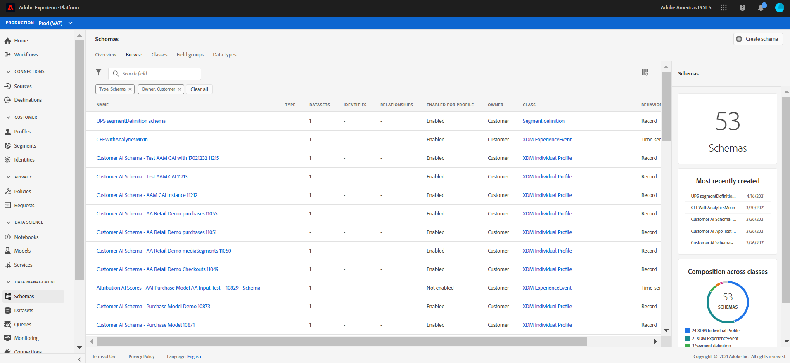
      -->
      
      <kbd></kbd> 
      
2. Click "Create Schema" on the top right and select "XDM ExperienceEvent".

      <!--
      
      -->
      
      <kbd>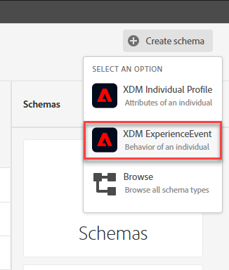</kbd>
      
3. Click on "Untitled Schema" in the Structure view.

    <!---
    
    --->

    <kbd></kdb>
      
      
4. In the right-hand menu, name it "Orders Schema &lt;your-assigned-number>" (Description is optional)
      
      <!--
      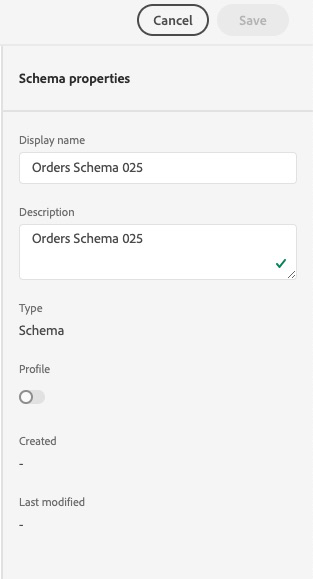
      -->
      
      <kbd></kdb>

      
5. In the left-hand schema composition menu, notice the class of "XDM ExperienceEvent". This value was set because you selected "XDM ExperienceEvent" after clicking the "Create Schema" button in a prior step. If you need to assign or change the class, you would click on the "+ Assign" button to the right of "Class".

    <!---
    
    --->

    <kbd>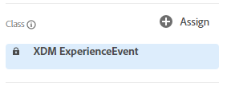</kdb>

      
      
    If you click on "Assign", you can add or change the base-level schema behavior:
    - Time-based Events (ExperienceEvent)
    - Customer Snapshots (Profile)
     
      <!--
      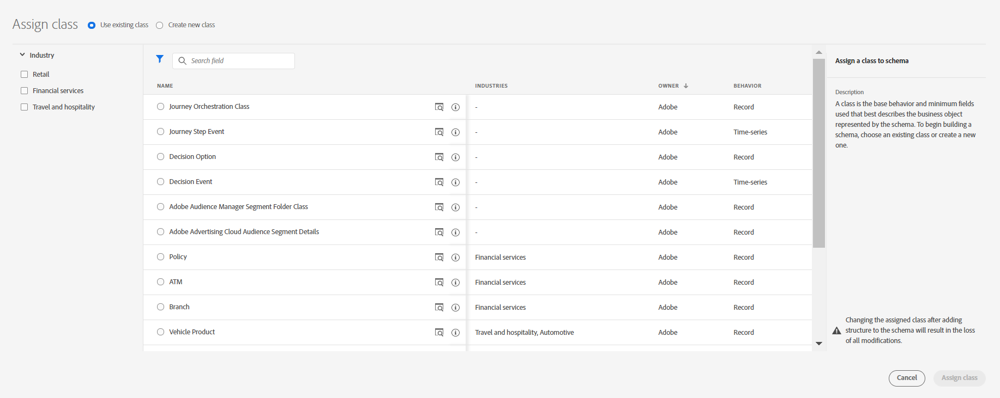
      -->
      
      <kbd></kdb>

      Note: There are other classes available out of the box that represent specific objects needed for Experience Modeling.

6. If you didn't select "XDM ExperienceEvent" when creating your schema, please review above step and choose "XDM ExperienceEvent" and click "Assign class".

      <!--
      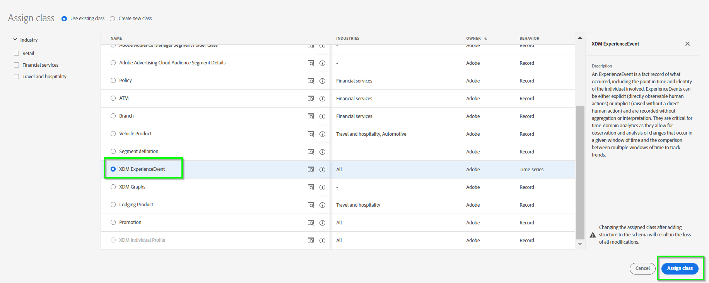
      -->
      
      <kbd></kdb>
       
      
7. Click on the "+ Add" button to the right of "Field groups" in the left panel.

    <!---
    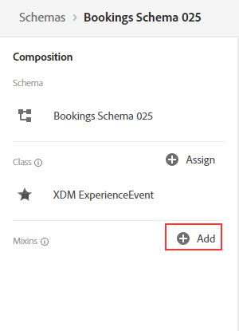
    --->

    <kbd>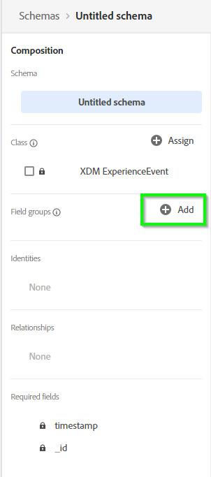</kdb>

      
      
      Here's where you can build your own Field group or use a prior/similar Field group object that conforms to your data.
           
      
8. In this lab, we will be adding three pre-built Field groups listed below:

      - Product Details Mixin EE,
      - Store Details Mixin EE,
      - Identities Mixin EE
     
     
      Select the 'Product Details Mixin EE', 'Store Details Mixin EE' and 'Identities Mixin EE' mixins, and click "Add field groups" button.
      
     <!-- 
     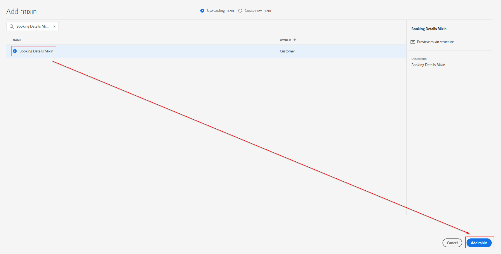
     -->
      <kbd>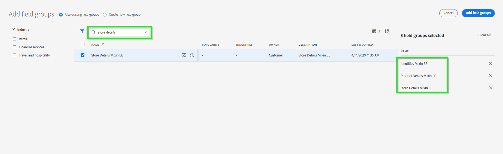</kdb>
      
      Your schema will now have the Product Details Mixin EE object (productDetails), Store Details Mixin EE object (storeDetails) and Identities Mixin EE object (identification) and all of their associated fields in each object.
      
      <kbd>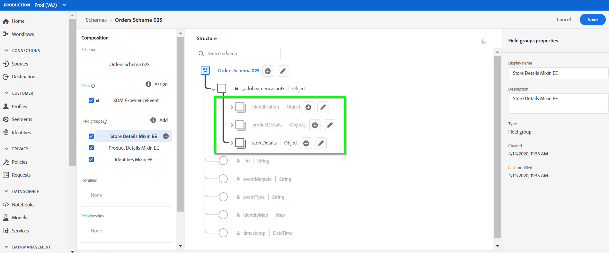</kdb>
      
        
9. Now, we'll create a new Field group from scratch. Go back and hit the "+ Add" button in the left panel.

      <kbd>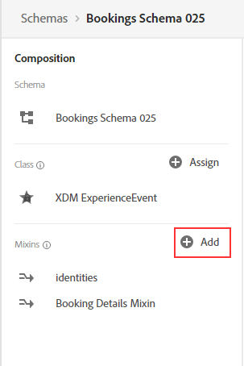</kdb>    
       
      
10. Select "Create new field group" at the top.

      <kbd>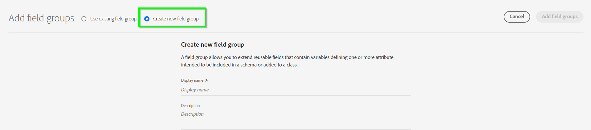</kdb>    
      
      
11. Display name is "Order Details Mixin EE &lt;your-assigned-number>" and then hit 'add field groups'.
      
    <!--  
    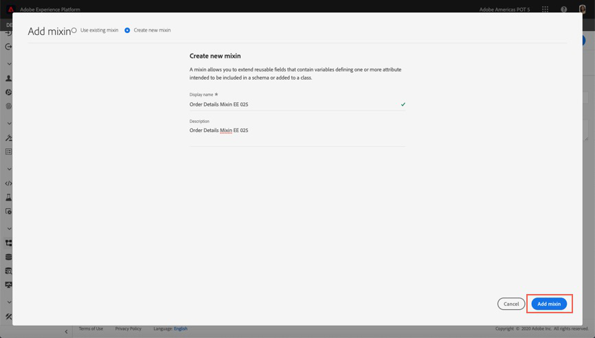
    --> 
    <kbd></kdb>     
     
12. In the left-hand schema composition menu, click on your newly create Field group (it should be highlighted now)

    <!---
    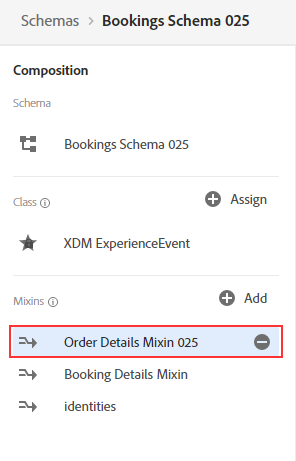
    --->

    <kbd></kdb>   
       

13. Notice that on the Structure view a '+ Add field' appears next to the Schema name. Click it to start adding fields.

    <!---
    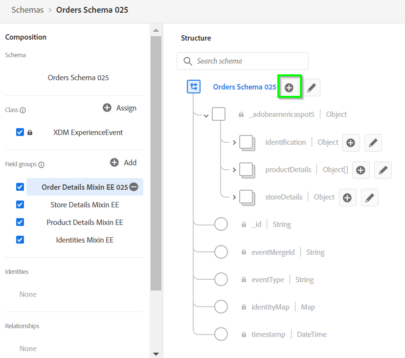
    --->

    <kbd></kdb>   

14. In the Field properties panel to the right, add the following:  
      - FieldName = orderDetails
      - Description = Order Details
      - Type = Object

    <!--  
    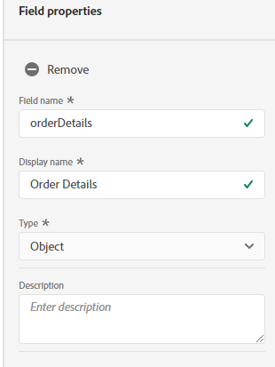
    -->
    <kbd></kdb>    

    Scroll  down and hit Apply

    <!--  
    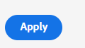
    -->
    <kbd></kdb>    

15. Next, we will be adding fields to the 'orderDetails' object. Click "+ Add Field" next to this object

    <!---
    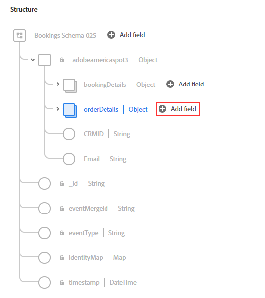
    --->

    <kbd></kdb>   

16. In the Field properties panel to the right, add the following:
      - FieldName = orderID
      - Description = Order ID
      - Type = String

     <!-- 
     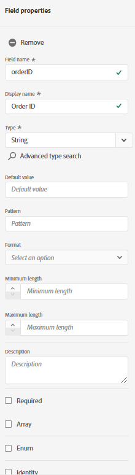
     -->
     <kbd></kdb>   

     Scroll down and hit Apply

    <!--  
    
    -->
    <kbd></kdb>    

17. We will be adding three more fields to the 'orderDetails' object.  Click "+ Add Field" next to the object.

    <!---
    
    --->

    <kbd></kdb>

18. In the Field properties panel to the right, add the following:
      - FieldName = orderType
      - Description = Order Type
      - Type = String

    <!--  
    
    -->
    <kbd>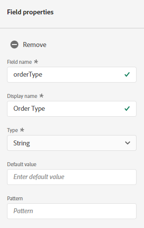</kdb>

    Scroll down and hit Apply

    <!--  
    
    -->
    <kbd></kdb>
    
19. Click "+ Add Field" next to the 'orderDetails' object.

    <!---
    
    --->

    <kbd></kdb>

20. In the Field properties panel to the right, add the following:
      - FieldName = orderFlag
      - Description = Order Flag
      - Type = Integer

    <!--  
    
    -->
    <kbd></kdb>

    Scroll down and hit Apply

    <!--  
    
    -->
    <kbd></kdb>
    
21. Click "+Add Field" next to the 'orderDetails' object.

    <!---
    
    --->

    <kbd></kdb>

22. In the Field properties panel to the right, add the following:  
      - FieldName = orderSKUcount
      - Description = Order SKU Count
      - Type = Integer

    <!--  
    
    -->
    <kbd>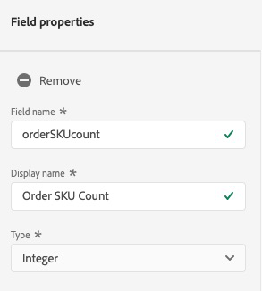</kdb>

    Scroll down and hit Apply

    <!--  
    
    -->
    <kbd></kdb>
    
    
23. We are done with modeling the schema. Make sure your schema structure looks like the one in the screenshot below.
 
     <!---
     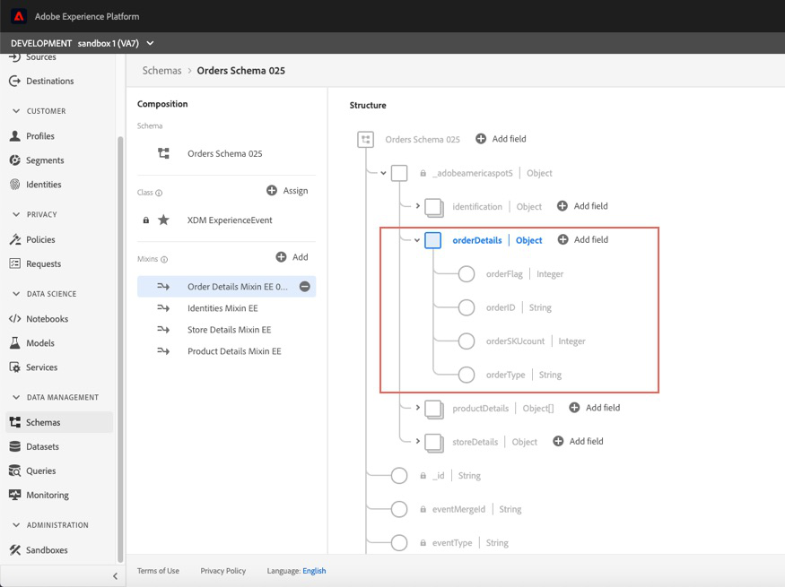
     --->
     <kbd></kdb>

24.  Save your schema. hit Save on the top right corner.

      <kbd></kdb>
 
25. Congratulations!!! You have constructed your schema.
 
 
 
 

Return to [Lab Agenda Directory](https://github.com/adobe/AEP-Hands-on-Labs/blob/master/labs/retail/README.md#lab-agenda)

