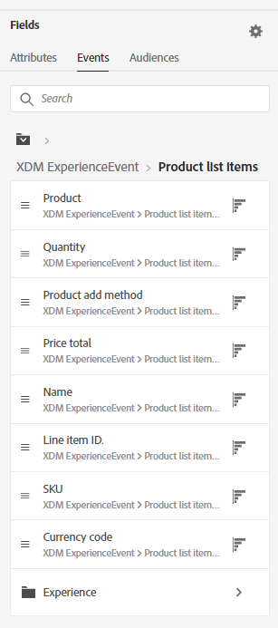

Lab 1 - Segmentation - Simple ExperienceEvent Segmentation
==========
<table style="border-collapse: collapse; border: none;" class="tab" cellspacing="0" cellpadding="0">

<tr style="border: none;">

<td width="600" style="border: none;">
<table>
<tbody valign="top">
      <tr width="500">
            <td valign="top"><h3>Objective:</h3></td>
            <td valign="top"> In this exercise, we’ll create a basic segment using a single field in Call Center ExperienceEvent. 
       On an ongoing basis, a retailer wants to create a basic segment for customers who place an order with a Call Center representative. This segment will be added to other segments for other marketing events. 
            </td>
     </tr>
     <tr width="500">
           <td valign="top"><h3>Prerequisites:</h3></td>
           <td valign="top"> none</td>
     </tr>
</tbody>
</table>
</td>

<td style="border: none;" valign="top">

<table>
<tbody valign="top">
      <tr>
            <td valign="middle" height="70"><b>section</b></td>
            <td valign="middle" height="70"></td>
      </tr>
      <tr>
            <td valign="middle" height="70"><b>version</b></td>
            <td valign="middle" height="70">1.0.1</td>
      </tr>
      <tr>
            <td valign="middle" height="70"><b>date</b></td>
            <td valign="middle" height="70">2020-01-06</td>
      </tr>
</tbody>
</table>
</td>

</tr>
</table>

Instructions:
-----------------
1.	Navigate to Segment Builder in the left navigation

      <kbd></kbd>

2.    Click "Create segment" on the top right.

      <kbd></kbd>

3.	Click the gear icon to the right of Fields in the left pane

      <kbd></kbd>

4.	Verify ‘Show full XDM schema’ is selected, and if not, select it
      <!--
      
      -->
      
      <kbd></kbd>
      
5.	Click on the gear icon again to hide the setting

      <kbd></kbd>

6.	Select ‘Events’ under Fields

      <kbd></kbd>

7.	Click on ‘XDM ExperienceEvent’ under Browse Classes

      <kbd></kbd>
      
8.	Click on ‘Adobeamericaspot 5’ to expand the objects below that namespace
      
      <kbd></kbd>

9.	Click on ‘callcenterDetails’
   
      <kbd></kbd>      

10.	Drag the ‘callSelectedReason’ field over to the Segment canvas
      <!--
      
      -->
      
      <kbd></kbd>    
      
11.	In the text box to the right of equals, type “Place Order” and press ‘Enter’
      <!--
      
      -->
      
      <kbd></kbd>  

12.	Ensure ‘Streaming’ is enabled in the right pane

      <kbd></kbd>  

13.	Enter the segment name “Call Center Order” followed by your Student ID (e.g. “Call Center Order 025”)
	 Enter the same value as the description
      
      <kbd></kbd>       
           
14.	Save the Segment
      <!--
      
      -->
      
      <kbd></kbd>  
      
NOTE: Estimate link may not show results if qualified profiles are statistically small and not recognized across datset scans 
 
 
 

Lab 2 - Segmentation - Multi-Entity Sequential Segmentation
==========
<table style="border-collapse: collapse; border: none;" class="tab" cellspacing="0" cellpadding="0">

<tr style="border: none;">

<td width="600" style="border: none;">
<table>
<tbody valign="top">
      <tr width="500">
            <td valign="top"><h3>Objective:</h3></td>
            <td valign="top"> In this exercise, we’ll create a segment using both a Profile Attribute and ExperienceEvents using a Sequential Segment that compares multiple event conditions 
       This month, a retailer wants to email a promotional discount offer to existing female customers who have viewed or begun an online order for their premier product but have not ordered the item after an hour of either online event. </td>
     </tr>
     <tr width="500">
           <td valign="top"><h3>Prerequisites:</h3></td>
           <td valign="top"> none</td>
     </tr>
</tbody>
</table>
</td>

<td style="border: none;" valign="top">

<table>
<tbody valign="top">
      <tr>
            <td valign="middle" height="70"><b>section</b></td>
            <td valign="middle" height="70"></td>
      </tr>
      <tr>
            <td valign="middle" height="70"><b>version</b></td>
            <td valign="middle" height="70">1.0.1</td>
      </tr>
      <tr>
            <td valign="middle" height="70"><b>date</b></td>
            <td valign="middle" height="70">2020-01-06</td>
      </tr>
</tbody>
</table>
</td>

</tr>
</table>

Instructions:
-----------------
1.	Navigate to Segment Builder in the left navigation

      <kbd></kbd>

2.    Click "Create segment" on the top right.

      <kbd></kbd>
      
      
3.	Click the gear icon to the right of Fields in the left pane

      <kbd></kbd>

4.	Verify ‘Show full XDM schema’ is selected and if not, select it

      <kbd></kbd>

5.	Click on the gear icon again to hide the setting
    
      <kbd></kbd>

6.	Select ‘Attributes’ under Fields
7.	Click on the ‘XDM Individual Profile’ object under Browse Attributes
8.	Click on ‘Person’ 
9.	Drag the ‘Gender’ field to the Segment canvas
10.	Start entering ‘Female’ in the text box and when the value displays, select it and press Enter. The ‘Gender’ field is an enum field to limit the values stored in that field.
      <!--
      
      -->
     
     <kbd></kbd>
      
11.	Next, select ‘Events’ under Fields in the left pane
12.	Under ‘Event Types’ locate the ‘Product Views’ event and drag that to the segment canvas below the Profile attribute just added
13.	Under ‘Events’ in the left pane, locate ‘Checkouts’ and drag that to the segment canvas below the ‘Product Views’ event so that they are vertically stacked.
14.	Update the operator to ‘Or’ between ‘Product Views’ and ‘Checkouts’
      <!--
      
      -->
      <kbd></kbd>
      
15.	Under ‘Events in the left pane, locate ‘Purchases’ and drag that to the segment canvas to the right of the ‘Product Views’ and ‘Purchase’ events
      <!--
      
      -->
            
       <kbd></kbd>
            
16.	Click on ‘Product Views’ in the segment canvas. A container will appear below to Include and XDM ExperienceEvent
17.	In the left pane, click on ‘XDM ExperienceEvent’ and ‘Product list items’ in the resulting display
18.	Select the ‘SKU’ field and drag that into the ‘XDM ExperienceEvent’ container for ‘Product Views’
19.	Enter ‘prd1030’ in the text box to the right of SKU = and press ‘Enter’
      <!--
      
      -->
      <kbd></kbd>

20.	Click on ‘Checkouts’ in the segment canvas. A container will appear below to Include and XDM ExperienceEvent
21.	In the left pane, click on ‘XDM ExperienceEvent’ and ‘Product list items’ in the resulting display
22.	Select the ‘SKU’ field and drag that into the ‘XDM ExperienceEvent’ container for ‘Checkouts’
23.	Enter ‘prd1030’ in the text box to the right of SKU = and press ‘Enter’
24.	Click on ‘Purchases’ in the segment canvas. A container will appear below to Include and XDM ExperienceEvent
25.	In the left pane, click on ‘XDM ExperienceEvent’ and ‘Product list items’ in the resulting display
26.	Select the ‘SKU’ field and drag that into the ‘XDM ExperienceEvent’ container for ‘Purchases’
27.	Enter ‘prd1030’ in the text box to the right of SKU = and press ‘Enter’
28.	Change the container operator to ‘Exclude’ for ‘Purchases’
      <!--
      
      -->
      
      <kbd></kbd>
            
29.	At the top of the ‘Events’ canvas, update the time value to ‘This month’
30.	In the middle, update the time value to ‘After 1 Hour’ between the ‘Product Views’ and ‘Checkouts’ and ‘Purchases’.
      <!--
      
      -->
      
      <kbd></kbd>      
      
31.	Ensure ‘Streaming’ is enabled in the right pane
32.	Enter the segment name “Premier Product High Intent Female Purchasers” followed by your Student ID (e.g. “Premier Product High Intent Female Purchasers 005”)
33.	Enter the same value as the description
34.	Save the Segment
      <!--
      
      -->
      
      <kbd></kbd>       
      
 
 
 
 

Lab 3 - Segmentation - Dynamic Segmentation
==========
<table style="border-collapse: collapse; border: none;" class="tab" cellspacing="0" cellpadding="0">

<tr style="border: none;">

<td width="600" style="border: none;">
<table>
<tbody valign="top">
      <tr width="500">
            <td valign="top"><h3>Objective:</h3></td>
            <td valign="top"> In this exercise, we’ll create a segment using Commerce ExperienceEvents and dynamic segmentation. Dynamic segmentation solves the scalability problems marketers traditionally face when building segments for marketing campaigns or other use cases where setting up multiple variations of the same segment was required. 
       On an ongoing basis, a retailer wants to remarket to customers who have clicked through an email offer for an item, started the order online in the last 3 days, but have not ordered the item within 1 day. </td>
     </tr>
     <tr width="500">
           <td valign="top"><h3>Prerequisites:</h3></td>
           <td valign="top"> none</td>
     </tr>
</tbody>
</table>
</td>

<td style="border: none;" valign="top">

<table>
<tbody valign="top">
      <tr>
            <td valign="middle" height="70"><b>section</b></td>
            <td valign="middle" height="70"></td>
      </tr>
      <tr>
            <td valign="middle" height="70"><b>version</b></td>
            <td valign="middle" height="70">1.0.1</td>
      </tr>
      <tr>
            <td valign="middle" height="70"><b>date</b></td>
            <td valign="middle" height="70">2020-01-06</td>
      </tr>
</tbody>
</table>
</td>

</tr>
</table>

Instructions:
-----------------
1.	Navigate to Segment Builder in the left navigation

      <kbd></kbd>

2.    Click "Create segment" on the top right.

      <kbd></kbd>

3.	Click the gear icon to the right of Fields in the left pane

      <kbd></kbd>

4.	Verify ‘Show full XDM schema’ is selected, and if not, select it
      <!--
      
      -->
      
      <kbd></kbd>
      
5.	Click on the gear icon again to hide the setting

      <kbd></kbd>

6.	Select ‘Events’ under Fields

      <kbd></kbd>
      
7.	In the search box, enter ‘Marketing Channel’
      <!--
      
      -->
      
      <kbd></kbd>      
            
8.	Under ‘Browse Classes’, drag ‘Marketing Channel (eVar1)’ to the segment canvas.
9.	In the left pane, clear out the Search box
10.	Under ‘Event Types’, locate ‘Checkouts, and drag this to the segment canvas to the right of the ‘Any’ event
11.	In the left pane, locate ‘Purchases’ and drag this to the segment canvas to the right of the ‘Checkouts’ event.
12.	Click on ‘Any’ in the segment canvas
13.	Type ‘Email’ in the text box to the right of ‘Marketing Channel (eVar1)’ equals and press Enter
      <!--
      
      -->
      
      <kbd></kbd>       
          
14.	Click on ‘Checkouts in the segment canvas
15.	In the left pane, click on ‘XDM ExperienceEvent’ and ‘Product list items’ in the resulting display
16.	Select the ‘SKU’ field and drag that into the ‘XDM ExperienceEvent’ container for ‘Checkouts’
17.	Change the operator to “exists”
      <!--
      
      -->
      
      <kbd></kbd>          
      
      <!--
      
      -->
      <kbd></kbd>          

18.	In the left pane, click on ‘XDM ExperienceEvent’ and ‘Product list items’ in the resulting display
19.	Select the ‘SKU’ field and drag that into the ‘XDM ExperienceEvent’ container for ‘Purchases’
20.	In the left pane, click on the Events link. You should see ‘Browse Classes’, ‘Event Types’ and ‘Browse Variables’ sections appear
      <!--
      
      -->
      
      <kbd></kbd>  
      
21.	Locate ‘Checkouts1 | Product list items1’ and drag this to the right of ‘SKU equals’ in the ‘XDM Event Container’. Release one the dynamic variable is positioned over the second box displays and drop. The resulting statement should be ‘SKU equals Checkouts1 | Product list items1 XDM ExperienceEvent > Product list items > SKU’

22.	Change the ‘XDM ExperienceEvent’ container for ‘Purchases1’ to ‘Exclude’
      <!--
      
      -->

      <kbd></kbd>  
      
23.	In the segment canvas, update the time value between ‘Any’ and ‘Checkouts’ to ‘Within 3 days’
24.	Next, update the time value between ‘’Any’ and ‘Purchases’ to ‘Within 1 day’
25.	Ensure ‘Streaming’ is enabled in the right pane
26.	Enter the segment name “Email Channel Online Order Abandoners” followed by your Student ID (e.g. “Email Channel Online Order Abandoners 005”)
27.	Enter the same value as the description
28.	Save the Segment

 
 
 

Return to [Lab Agenda Directory](https://github.com/adobe/AEP-Hands-on-Labs/blob/master/labs/travel/README.md#lab-agenda)
 
 
