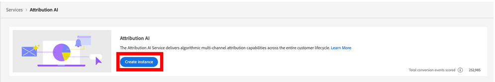
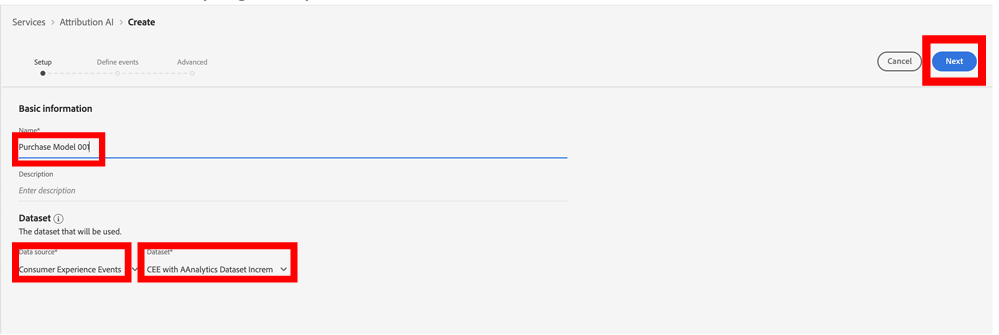
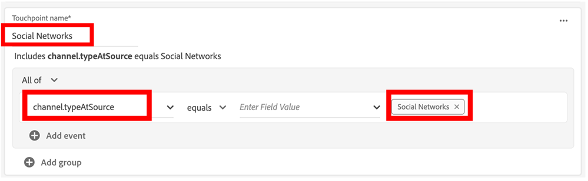
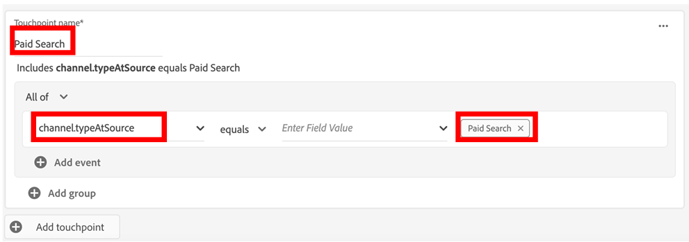

Lab  - Create Attribution AI Instance  
==========
<table style="border-collapse: collapse; border: none;" class="tab" cellspacing="0" cellpadding="0">

<tr style="border: none;">

<td width="600" style="border: none;">
<table>
<tbody valign="top">
      <tr width="500">
            <td valign="top"><h3>Objective:</h3></td>
            <td valign="top"> In this exercise, we’ll create an Instance of Attribution AI. 
            </td>
     </tr>
     <tr width="500">
           <td valign="top"><h3>Prerequisites:</h3></td>
           <td valign="top"> Services</td>
     </tr>
</tbody>
</table>
</td>

<td style="border: none;" valign="top">

<table>
<tbody valign="top">
      <tr>
            <td valign="middle" height="70"><b>section</b></td>
            <td valign="middle" height="70"></td>
      </tr>
      <tr>
            <td valign="middle" height="70"><b>version</b></td>
            <td valign="middle" height="70">1</td>
      </tr>
      <tr>
            <td valign="middle" height="70"><b>Date</b></td>
            <td valign="middle" height="70">2021-05-18</td>
      </tr>
</tbody>
</table>
</td>

</tr>
</table>

Instructions:
-----------------
1.	Go to https://platform.adobe.com/home. 
2.	Please ensure that you are in your allotted sandbox for this exercise.
3.	In the left-hand menu, navigate to Services and click on Open within the Attribution AI section. 

4. Click Create Instance. This will take you to the setup stage of the Attribution AI workflow. 

5. Enter a name for this instance. Call it “Purchase Model” follow by your sandbox number. E.g. Purchase Model 001
6. Set your Data Source to Consumer Experience Events. *** 
7. Set the Dataset to CEE with Analytics Dataset. *** 
8. ShapeShapeShapeShapeClick Next on the top right of your screen

9.  Enter Orders for the Conversion Name. 
10. Below the Conversion Name, make sure that All of is selected. 
11. Then search for and select commerce.order.purchaseID.  
12. To the right of commerce.order.purchaseID, make sure that exists is selected. 
13. The default in the Define Lookback Window is 56 days prior to a conversion event and we will keep the default.

14. Scroll down to Define Touchpoints. 
15. Enter Email for the Touchpoint Name. 
16. Below the Touchpoint name, select All of and type in channel.typeAtSource. 
17. To the right of channel.typeAtSource, click on exists and change to equals then search for and select Email.  
18. Click on Add touchpoint at the bottom of the Email touchpoint.
19. At this point we will create a few more touchpoints. 
20. Enter Social Campaigns for the Touchpoint Name. 
21. Below the Touchpoint name, select All of and type in channel.typeAtSource. 
22. To the right of channel.typeAtSource, click on exists and change to equals then search for and select Social Campaigns. 
23. Click on Add touchpoint at the bottom of the Email touchpoint.

 24. Enter Social Networks for the Touchpoint Name. 
 25. Below the Touchpoint name, select All of and type in channel.typeAtSource. 
 26. To the right of channel.typeAtSource, click on exists and change to equals then search for and select Social Networks.  
 27. Click on Add touchpoint at the bottom of the Email touchpoint.
 28. Enter Paid Search for the Touchpoint Name. 
 29. Below the Touchpoint name, select All of and type in channel.typeAtSource. 
 30. To the right of channel.typeAtSource, click on exists and change to equals then search for and select Paid Search.

31. Once you have Defined all of your Touchpoints click on Next in the top right of your screen.

32. This will take you the Advanced page for Attribution AI. Take a second to review the options on this page.  
33. Let’s make a weekly schedule for this Attribution AI Model. Select Monday at 5:00am. 
34. Once you have reviewed the Advanced page click on Finish in the top right of your screen.

35. Congratulations! You have created an Attribution AI model. 

 
 
 

Return to [Lab Agenda Directory](https://github.com/adobe/AEP-Hands-on-Labs/blob/master/labs/retail/README.md#lab-agenda)
