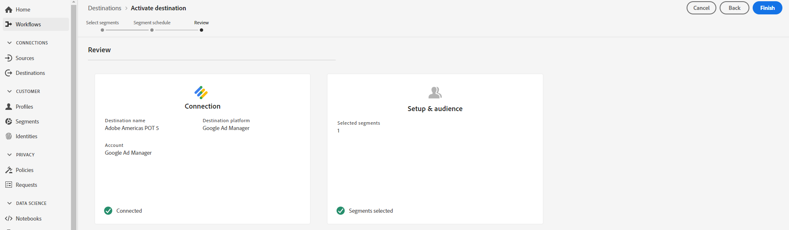

Lab  - Activation of a Segment to a Destination 
==========
<table style="border-collapse: collapse; border: none;" class="tab" cellspacing="0" cellpadding="0">

<tr style="border: none;">

<td width="600" style="border: none;">
<table>
<tbody valign="top">
      <tr width="500">
            <td valign="top"><h3>Objective:</h3></td>
            <td valign="top"> In this exercise, we’ll share a segment created in a previous lab with the Google Ad Manager destination configured in AEP. 
            </td>
     </tr>
     <tr width="500">
           <td valign="top"><h3>Prerequisites:</h3></td>
           <td valign="top"> Google Ad Manager Destination</td>
     </tr>
</tbody>
</table>
</td>

<td style="border: none;" valign="top">

<table>
<tbody valign="top">
      <tr>
            <td valign="middle" height="70"><b>section</b></td>
            <td valign="middle" height="70"></td>
      </tr>
      <tr>
            <td valign="middle" height="70"><b>version</b></td>
            <td valign="middle" height="70">2</td>
      </tr>
      <tr>
            <td valign="middle" height="70"><b>date</b></td>
            <td valign="middle" height="70">2020-07-17</td>
      </tr>
</tbody>
</table>
</td>

</tr>
</table>

Instructions:
-----------------
1.	In the left navigation of AEP, select Destinations > Browse.
2.	Click ‘Adobe Americas POT 5’. 

3.	Once you select the destination, click on ‘Edit Activation’. This takes you to the Activate flow.

 
4.	In the Activate destination wizard > Select Segments step, select the checkbox for your version of the “Call Center Order” segment you created in the previous lab.

 
5.	Select Next in the upper top corner of the workflow

6.	On the Segment Schedule page, you can see the start date for sending data to the destination. Some destinations will display the frequency of sending data to the destination. Since we're activating a segment to Google, this will be sent to the destination once per day, and this is the only option for this destination.
7.	Click on ‘Next’ in the upper top corner of the workflow

8.	On the Review page, you can see a summary of your selection. Please do not select 'Finish' for your segment in the lab; rather, select 'Cancel' to exit out the activation workflow.

 
 
 

Return to [Lab Agenda Directory](https://github.com/adobe/AEP-Hands-on-Labs/blob/master/labs/retail/README.md#lab-agenda)
