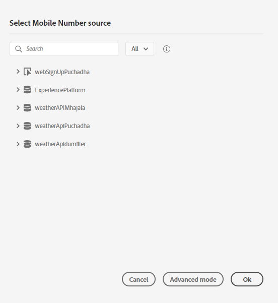
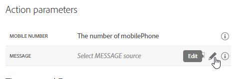
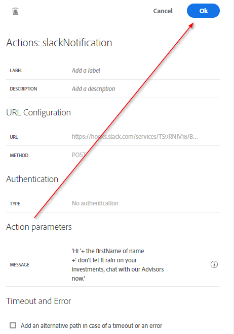

## Exercise 4 - Design a trigger-based Customer Journey

In this exercise, you'll create an Orchestrated Journey by making use of Journey Orchestration in combination with Adobe Experience Platform

Go to [https://experience.adobe.com/#/@adobeamericaspot5/home](https://experience.adobe.com/#/@adobeamericaspot5/home)

You'll see the `Adobe Experience Cloud`-homepage.

Click on `Journey Orchestration`.

Next, you'll see the `Journey Orchestration`-homepage, which shows all existing Journeys.

Click `Create` to start creating your Journey.

You'll then see a new, blank Journey.

<!---

--->

<kbd></kdb>

You should first name your Journey.

As a Name for the Journey, use **Website Registration Journey emailAddress** and replace **emailAddress** with LDAP. In this example, the Journey Name is **Website Registration Journey puchadha**. No other values must be set at this moment.

<!---

--->

<kbd></kdb>

Click `OK`.

On the left side of your screen, have a look at `Events`. You should see your previously create Event on that list. Select it, then drag and drop it on the Journey Canvas.

Your Journey then looks like this:

Next, click on `Orchestration`.

You now see `Orchestration`-capabilities.

Select `Condition`, then drag and drop it on the Journey Canvas.

<!---

--->

<kbd></kdb>

You now have to define 2 conditions:

- It's Raining
- It's Clear

Let's define the first condition.

#### Condition 1: It's Raining

Click on the `Condition`.

<!---

--->

<kbd></kdb>

Click on the `Edit`-icon for the expression of Path1.

<!---

--->

<kbd></kdb>

You'll then see an empty `Simple Editor`-screen.

Our query will be a bit more advanced, so we'll need the `Advanced Mode`.
Click `Advanced Mode`.

You'll then see the `Advanced Editor` which allows code entry. Paste it in `##{weatherApiemailAddress.WeatherByZipemailAddress.weather.main} == 'Rain'` (replace emailAddress)

You'll then see this.

In order to retrieve the temperature as part of this Condition, you need to provide the zipCode in which the customer currently is.
The `zipCode` needs to be linked to the dynamic parameter `zip`.

Click the field `dynamic val: zip` as indicated in the screenshot.

<!---

--->

<kbd></kdb>

You then need to find the field that contains the current zip code of the customer in the AEP Data Sources. Here we are leveraging the unified profile data in AEP to get the profiles zip code.

You can navigate the field structure from the panel or simply paste the expression below into the expression text box.
`#{ExperiencePlatform.ProfileFieldGroup.profile.homeAddress.postalCode}`

Click `OK`.

Rename the path from path1 to 'Raining'

<!---

--->

<kbd></kdb>

Next, we'll add the 2nd condition.

#### Condition 2: Its Clear

After having added the first condition, you'll see this screen.

<!---

--->

<kbd></kdb>

Click `Add Path`.

Click on the `Edit`-icon for the expression of Path1.

<!---

--->

<kbd></kdb>

You'll then see an empty `Simple Editor`-screen.

Our query will be a bit more advanced, so we'll need the `Advanced Mode`.
Click `Advanced Mode`.

You'll then see the `Advanced Editor` which allows code entry. Paste it in `#{weatherApiemailAddress.WeatherByZipemailAddress.weather.main} == 'Clear'` (replace emailAddress)

You'll then see this.

To retrieve the temperature as part of this Condition, you need to provide the zipCode in which the customer currently is.
The `zipCode` needs to be linked to the dynamic parameter `zip`.

Click the field `dynamic val: zip` as indicated in the screenshot.

<!---

--->

<kbd></kdb>

You then need to find the field that contains the current zip code of the customer in the AEP Data Sources. Here we are leveraging the unified profile data in AEP to get the profiles zip code.

You can navigate the field structure from the panel or simply paste the expression below into the expression text box.
`#{ExperiencePlatform.ProfileFieldGroup.profile.homeAddress.postalCode}`

Click `OK`.

Rename the path from path1 to 'Clear'

<!---

--->

<kbd></kdb>

Hit Ok on the top right

Next, we will be adding in Actions.

#### Add Actions for Raining Path

We'll attempt to send an SMS message to our customer.

Your Journey will then look like this. Click on `Actions` as indicated in the screenshot.

Select the smsNexmoemailAddress - action (your emailAddress), then drag and drop it after the condition you just added.

You'll see a popup.

<!---

--->

<kbd></kdb>

Navigate to the `Action Parameters`.

<!---

--->

<kbd></kdb>

Click on the `Edit`-icon for the Action Parameter `Mobile PhoneNumber`.

In the popup, you'll see, click on `Advanced Mode`.

Select the below code, copy it, and paste it in the `Advanced Mode Editor`.

`#{ExperiencePlatform.ProfileFieldGroup.profile.mobilePhone.number}`

Click `OK`.

Click on the `Edit`-icon for the Action Parameter `Message`.

<!---

--->

<kbd></kdb>

You'll see a popup with the `Simple Mode Editor`.

In the popup, you'll see, click on `Advanced Mode`.

Paste this code in the `Advanced Mode Editor`. Click `OK`.

`"Hi "+ #{ExperiencePlatform.ProfileFieldGroup.profile.person.name.firstName} +" don't let it rain on your investments, chat with our Advisors now."`

Click `OK`.

Click `OK`.

<!---

--->

<kbd></kdb>

In the left menu, go back to `Actions`, select the Action `slackNotification`, then drag and drop it after the `smsNexmoemailAddress`-Action (Replace emailAddress).

<!---

--->

<kbd></kdb>

Go to `Action Parameters` and click the `Edit`-icon for the parameter `Message`.

<!---

--->

<kbd></kdb>

In the popup window, click `Advanced Mode`.

Select the below code, copy it, and paste it in the `Advanced Mode Editor`.

`"Hi "+ #{ExperiencePlatform.ProfileFieldGroup.profile.person.name.firstName} +" don't let it rain on your investments, chat with our Advisors now."`

Click `OK`.

Click `OK`.

<!---

--->

<kbd></kdb>

In the left menu, go to `Orchestration`, select `End`, then drag and drop `End` after the `textSlackLdap`-Action.

<!---

--->

<kbd></kdb>

#### Add Actions for Clear Weather Path

We'll attempt to send an SMS message to our customer.

Your Journey will then look like this. Click on `Actions` as indicated in the screenshot.

Select the smsNexmoemailAddress - action (your emailAddress), then drag and drop it after the condition you just added.

<!---

--->

<kbd></kdb>

You'll see a popup.

<!---

--->

<kbd></kdb>

Navigate to the `Action Parameters`.

<!---

--->

<kbd></kdb>

Click on the `Edit`-icon for the Action Parameter `Mobile PhoneNumber`.

In the popup, you'll see, click on `Advanced Mode`.

Select the below code, copy it, and paste it in the `Advanced Mode Editor`.

`#{ExperiencePlatform.ProfileFieldGroup.profile.mobilePhone.number}`

Click `OK`.

Click on the `Edit`-icon for the Action Parameter `Message`.

<!---

--->

<kbd></kdb>

You'll see a popup with the `Simple Mode Editor`.

In the popup, you'll see, click on `Advanced Mode`.

Paste this code in the `Advanced Mode Editor`. Click `OK`.

`"Hi "+ #{ExperiencePlatform.ProfileFieldGroup.profile.person.name.firstName} +" have a clear path to Retirement, chat with our Advisors now."`

Click `OK`.

Click `OK`.

<!---

--->

<kbd></kdb>

In the left menu, go back to `Actions`, select the Action `slackNotification`, then drag and drop it after the `smsNexmoemailAddress`-Action (Replace emailAddress).

<!---

--->

<kbd></kdb>

Go to `Action Parameters` and click the `Edit`-icon for the parameter `Message`.

<!---

--->

<kbd></kdb>

In the popup window, click `Advanced Mode`.

Select the below code, copy it, and paste it in the `Advanced Mode Editor`.

`"Hi "+ #{ExperiencePlatform.ProfileFieldGroup.profile.person.name.firstName} +" have a clear path to Retirement, chat with our Advisors now."`

Click `OK`.

Click `OK`.

<!---

--->

<kbd></kdb>

In the left menu, go to `Orchestration`, select `End`, then drag and drop `End` after the `textSlackLdap`-Action.

<!---

--->

<kbd></kdb>

Your Journey is now fully configured.

Click `Publish`.

Click `Publish`.

Your Journey is now published.

---
