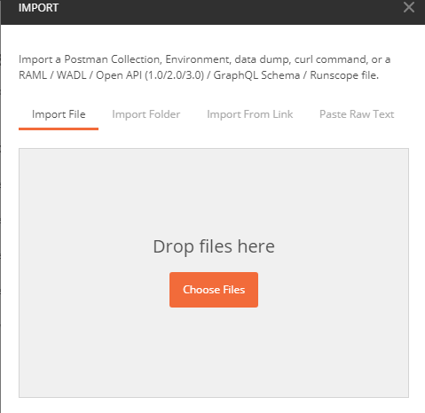
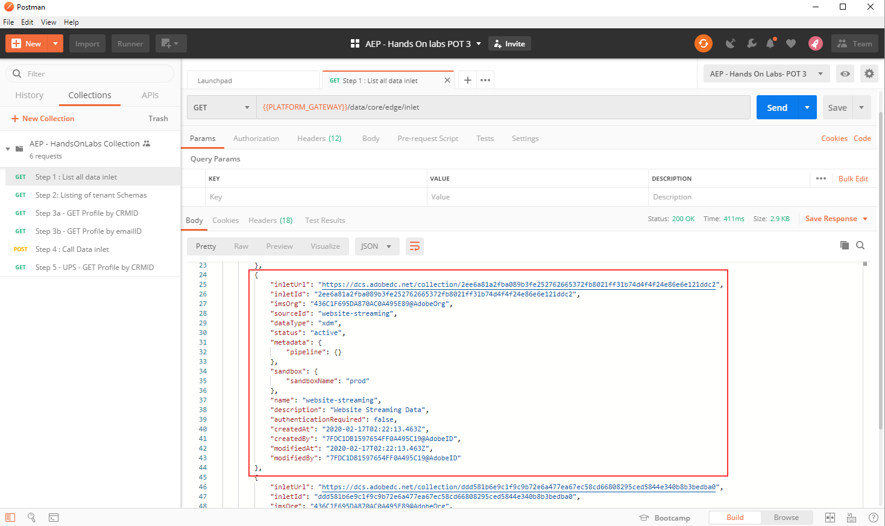
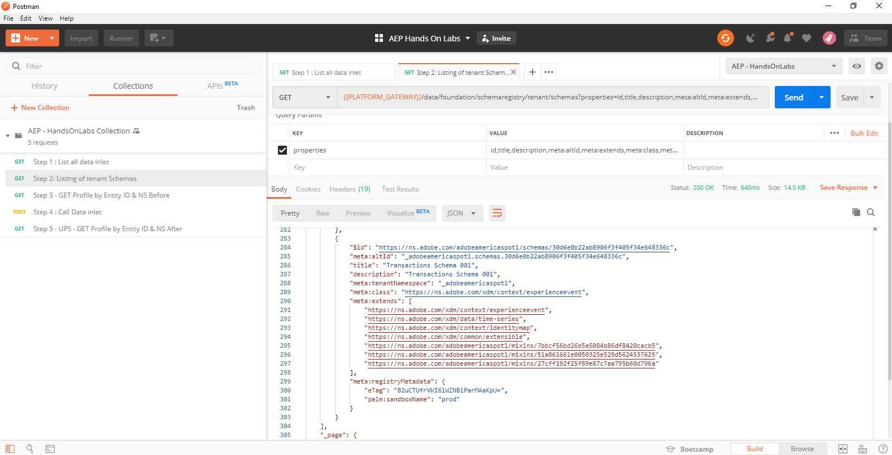
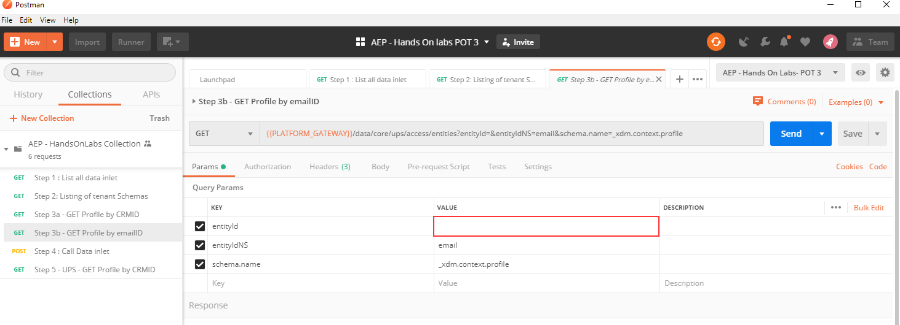
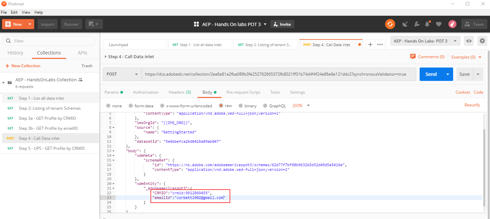

Lab - Using Data Ingestion API to Stitch customer data.
==========
<table style="border-collapse: collapse; border: none;" class="tab" cellspacing="0" cellpadding="0">

<tr style="border: none;">

<td width="600" style="border: none;">
<table>
<tbody valign="top">
      <tr width="500">
            <td valign="top"><h3>Objective:</h3></td>
            <td valign="top"> This will show how AEP API calls will stich different identities together 
            </td>
     </tr>
     <tr width="500">
           <td valign="top"><h3>Prerequisites:</h3></td>
           <td valign="top"> download JSON collection and envirnoment (Shared via Email)
           </td>
     </tr>
</tbody>
</table>
</td>

<td style="border: none;" valign="top">

<table>
<tbody valign="top">
      <tr>
            <td valign="middle" height="70"><b>section</b></td>
            <td valign="middle" height="70"></td>
      </tr>
      <tr>
            <td valign="middle" height="70"><b>version</b></td>
            <td valign="middle" height="70">1.0.1</td>
      </tr>
      <tr>
            <td valign="middle" height="70"><b>date</b></td>
            <td valign="middle" height="70">2020-01-06</td>
      </tr>
</tbody>
</table>
</td>

</tr>
</table>

Instructions:
-----------------
1. Open the Postman

    <!---
    
    --->

    <kbd></kdb>

2. Click on Import 

     

3. Then drag an drop 'AEP - HandonLabs.postman_environment.json' and AEP - HandsOnLabs Collection.json' files

    <!---
    
    --->

    <kbd></kdb>
     
     
4. Select 'AEP - HandsOnLabs' environment.

    <!---
    
    --->

    <kbd></kdb>
    
     
     
5. Click on the 'AEP - HandsOnLabs Collection' and open 'Step 1 : List all data inlet'.

    This API call will list all of the HTTPS API endpoint on our instance. These endpoints are allowed to stream in data into AEP. 

    <!---
    
    --->

    <kbd></kdb>
    
    
6. Hit Send

    <!---
    
    --->

    <kbd></kdb>

    On the API response, you will see the details for all data inlets

    <!---
    
    --->

    <kbd></kdb>

7. Click and open 'Step 2: Listing of tenant Schemas' and hit Send

    This API call will get all the schemas in the instance. note we restrict the properties that are returned from the API call to make the repose more manageable to read.

    Try to search for the schema you created during the schema excises.

    <!---
    
    --->

    <kbd></kdb>

8. Next, click and open 'Step 3a - GET Profile by CRMID' and add in the entityId parameter entry the CRMID aassigned to your attendee ID [here](https://raw.githubusercontent.com/adobe/AEP-Hands-on-Labs/master/labs/fsi/unlinked_fsi.md).

    <!---
    
    --->

    <kbd></kdb>

    This API call is part of the profile API and will return the profile object associated with an identity. 

9. Next, click and open 'Step 3b - GET Profile by emailID' and add in the entityId parameter entry the emailID aassigned to your attendee ID [here](https://raw.githubusercontent.com/adobe/AEP-Hands-on-Labs/master/labs/fsi/unlinked_fsi.md).
    <!---
    
    --->

    <kbd></kdb>

10. Next, click and open 'Step 4 : Call Data inlet'

    This API call is where we will stitch the profile fragments for the CRMID and email address, effectively stitching them into one unified profile, notice that all profile attributes will merge.

    Before you hit send, click on the API body and make sure you add the CRMID and emailID from previous steps

    <!---
    
    --->

    <kbd></kdb>

11. Finally, to view the stitched profile data click and open 'Step 5 - UPS - GET Profile by CRMID' add in the CRMID provided and hit send.

    <!---
    
    --->

    <kbd></kdb>

12. With that, Congratulations !! you have completed the API exercise.

Return to [Lab Agenda Directory](https://github.com/adobe/AEP-Hands-on-Labs/blob/master/labs/travel/README.md#lab-agenda)
