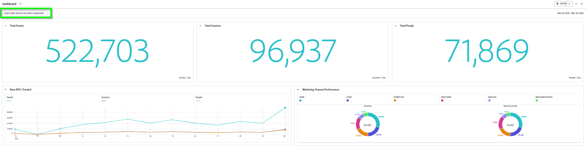
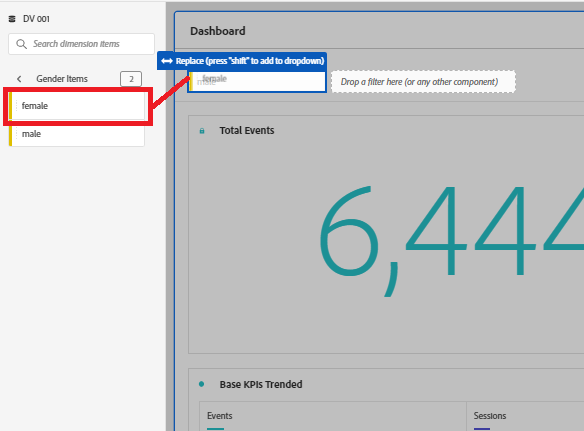
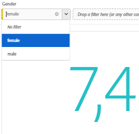
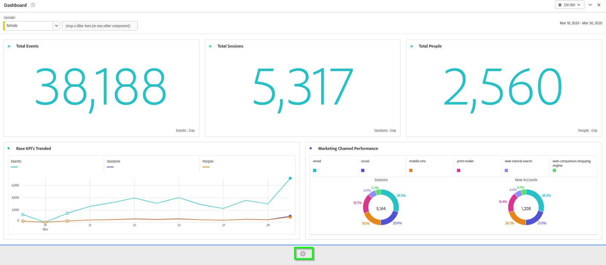
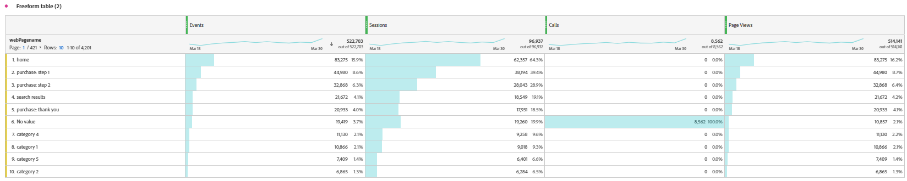
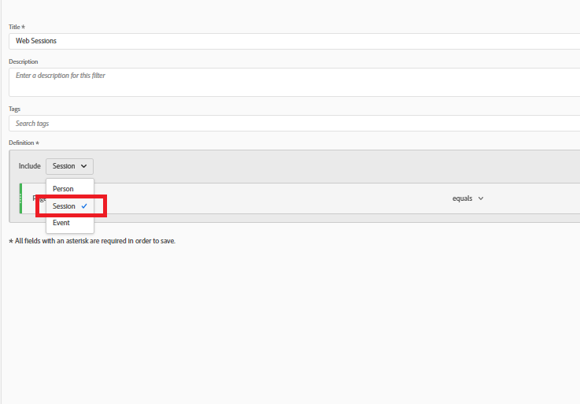
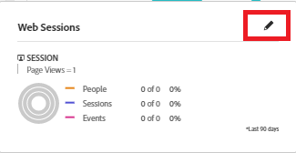
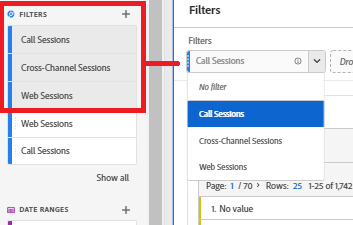
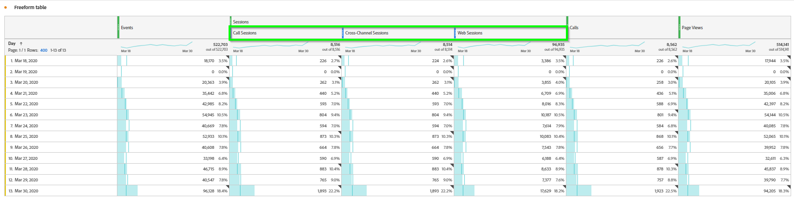

Lab  - Filters
==========
<table style="border-collapse: collapse; border: none;" class="tab" cellspacing="0" cellpadding="0">

<tr style="border: none;">

<td width="600" style="border: none;">
<table>
<tbody valign="top">
      <tr width="500">
            <td valign="top"><h3>Objective:</h3></td>
            <td valign="top"> This lab will show you how to use filters for CJA analyses.
            </td>
     </tr>
     <tr width="500">
           <td valign="top"><h3>Prerequisites:</h3></td>
           <td valign="top"> none
           </td>
     </tr>
</tbody>
</table>
</td>

<td style="border: none;" valign="top">

<table>
<tbody valign="top">
      <tr>
            <td valign="middle" height="70"><b>section</b></td>
            <td valign="middle" height="70">CJA</td>
      </tr>
      <tr>
            <td valign="middle" height="70"><b>version</b></td>
            <td valign="middle" height="70">1.0.10</td>
      </tr>
      <tr>
            <td valign="middle" height="70"><b>date</b></td>
            <td valign="middle" height="70">2021-05-24</td>
      </tr>
</tbody>
</table>
</td>

</tr>
</table>

After completing the Dashboard Lab, the Dashboard now looks exactly how we want it. Next we would like to be able to filter this Dashboard by the Gender of the customers. One of the sources loaded was CRM data and Gender was one of the attributes included in the CRM data.

There are a couple ways to apply Filters.
1. Drag a filter in one at a time
2. Add multiple filters to a drop-down which allows users to select the filter they want to apply as they need it.

**Dragging a Filter One at a Time.**

1. Scroll to the top of the dashboard.
2. In the top left area of the panel is an area where we can drop filters.
 
<kbd></kbd> 

3. Search for "Gender" in the Components menu.
4. Click on the arrow to the right of the Gender dimension to see the items in that dimension.
  
<kbd></kbd> 

5. You may need to click "Show items from the last X months" multiple times.

<kbd></kbd> 

6. Drag "male" from the Gender dimension and drop it into the Filter drop zone to filter the entire dashboard by "Male" customers.
 
<kbd></kbd> 

7. To filter by "Females", drag "female" from the Gender dimension and drop it over "male" in the Filter drop zone when it says "Replace".
 
<kbd></kbd> 

**Add Multiple Filters to a Drop-down**

Instead of dragging individual item, we can create a Filter drop-down that allows us to pick our filter from a drop-down.

1. Grab male" again and hover over "female" in the Filter drop zone. When it highlights "Replace (press shift to create a drop-down)", hold shift and drop "male".
This will create a drop-down menu that can be used to slice the project by either male or female customers. Any number of dropdowns can be created.
      - If you select multiple dropdowns at the same time, they act as an AND clause. By default, any filter applied in the Filter drop zone is an event-based filter, but that can be modified.

<kbd></kbd> 

**Analysis Using Filters**

Let's go a bit deeper into the types of analysis that we can do with CJA.
To do that we'll build some Filters that allow us to look at Sessions and break them into different types of sessions.
      - The data we're working with has Web Analytics data as well as Call Center data and some CRM data. We want to break the "Sessions" metric apart so we can see Web Sessions, Call Sessions, and Sessions where a customer touches both Web and Call (Cross-Channel Sessions).

1. We'll do this by creating some Filters we can then apply against the data as well as use in metrics.
      - Click the + sign below the Panel we were working on to create a new Panel.
 
<kbd></kbd> 

This creates a new Panel in the Project we're working on, that asks where we want to start.

2. We want start with a Freeform Table, so click on Freeform Table.
 
<kbd></kbd> 

Ensure you're using the "DV 001" Data View and that the Date Range is set to the correct date range: March 18-30, 2020

3. Drag the "Day" dimension into the table.
 
<kbd></kbd> 

4. Drag the "Sessions" metric onto the table to the right of "Events" metric.
5. Drag the "Calls" metric into that same table and drop it to the right of the "Sessions" metric.
6. Drag the "Page Views" metric and drop it into the same table to the right of the "Calls" metric.
 
<kbd></kbd> 

The "Calls" metric represents rows of data that come from the Call dataset.
      - The "Page Views" metric represents rows of data from the Web Analytics data.

7. Hover at the top of the Freeform table we were just working on until your mouse turns into the crosshairs and right-click to duplicate that visualization.
 
<kbd></kbd> 

8. In the duplicated copy of the table, replace the "Day" dimension with the "webPagename" dimension by dragging it over "Day" in the table and drop to replace "Day" with "webPagename".
 
<kbd></kbd> 

You'll see in the resulting data that there are Events and Sessions associated with each page and there are Page Views associated with each page (which equals the "Events" metric), but there are no Calls associated with each Page.
      - This is because there are no rows that are both Web and Call rows.
 
<kbd></kbd> 

9. Duplicate this table again and replace the “webPagename” dimension with the “callSelectedReason” dimension. This is the reason for a call that a call center agent entered when they spoke with a customer on the phone.
      - Notice how there are now Call Reasons that have Events and Sessions and Calls associated with them but no Page Views. Again, this makes sense.
 
<kbd></kbd> 

**Filtering by Types of Sessions**

1. Click on the "+" icon to the right of Filters in the Components menu to open up the Filter Builder.
 
<kbd></kbd> 

2. We'll build a Filter for Web Sessions first: name it "Web Sessions".
3. Drag the Page Views metric into the drop zone.
4. Change the criteria from Page Views = 1 to "exists".
 
<kbd></kbd> 

5. Change the "Include" drop-down from "Event" to "Session".
 
<kbd></kbd> 

This Filter will allow us to filter by Sessions that have at least one Page View in them.

6. Click Save.
      - Notice the new Web Sessions Filter in the Components menu.

7. Hover over the Web Sessions filter in the Components menu and click on the "i" to see details of the filter.
 
<kbd></kbd> 

8. Click on the pencil icon to bring up the Filter Builder with the same metric we just built.
 
<kbd></kbd> 

9. We're going to make a few changes and save as a new Cross-Channel Sessions filter.
10. Change the name from "Web Sessions" to "Cross-Channel  Sessions".
11. Drag the "Calls" metric and drop it below the Page Views metric.
12. Change the criteria for the Calls metric from "equals 1" to "exists".

<kbd></kbd> 

This filter will find sessions where a customer had at least one Page View and at least one Call in a session.

13. Click on Save As to save a new filter called "Cross-Channel Sessions".
      - We now have a Web Sessions filter and a Cross-Channel Sessions filter.

14. Hover over the Cross-Channel Sessions filter in the Components menu, click on the "i" next to the filter and click on the pencil icon.
 
<kbd></kbd> 

15. Once in the Filter Builder again, change the name to "Call Sessions" and remove the criteria that a Page View exists and click Save As.
 
<kbd></kbd> 

We now have the 3 filters we need to do some interesting cross-channel analysis.

16. Duplicate the last table you built again and multi-select the 3 filters you just built and drag them over the “callSelectedReason” dimension in the duplicated copy of the table and "Replace" that dimension with those 3 filters.
      - This provides an interesting view. We can see there are Web Sessions with Calls, and Call Sessions with Page Views.
 
<kbd></kbd> 

17. Scroll back up to the very top of the Panel that we're working on.
18. Drag the 3 filters just created and drop them into the Filter drop zone in the top left of the panel, while holding shift to create a drop-down menu.
 
<kbd></kbd> 

We can now filter by the various Sessions for which we built filters. 

19. Click on the Filter drop-down and select "No filter" to ensure no filters are being applied.
 
<kbd></kbd> 

20. Now take the 3 filters and drag them under the "Sessions" metric in the Day table until the blue pop-up says "Filter By", and drop the filters.
 
<kbd></kbd> 

This will break out the "Sessions" metric by the various Session types the filters represent. A great way to analyze the types of Sessions customers are having.
Using the knowledge from the earlier exercises you can imagine the types of dashboards you could create with this data.

### This completes the Filter creation excercise in CJA  
Next we will review how to build calculated [Metrics](https://github.com/adobe/AEP-Hands-on-Labs/blob/master/labs/retail/Foundations/CJA-Metrics.md)

