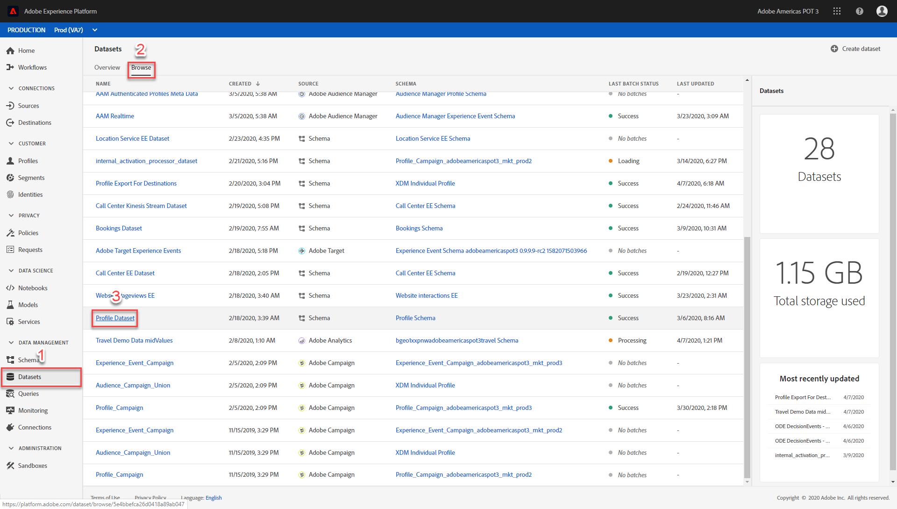
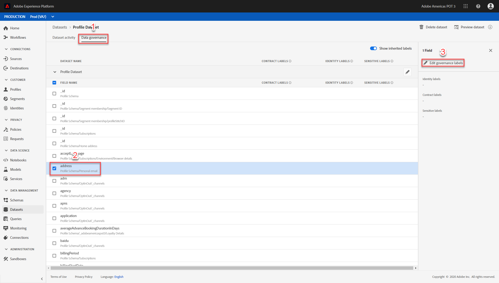
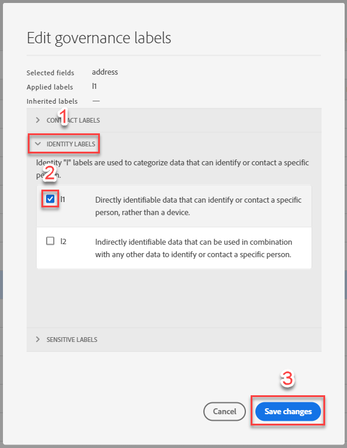
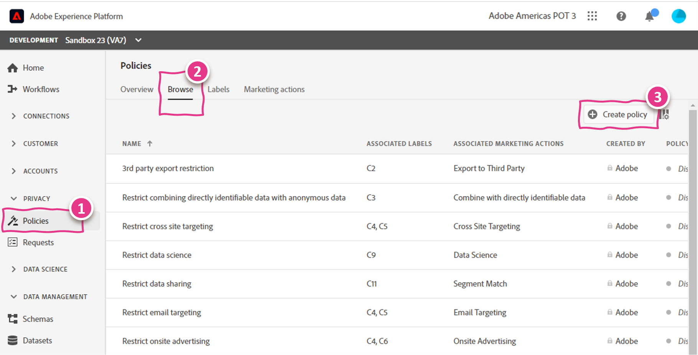
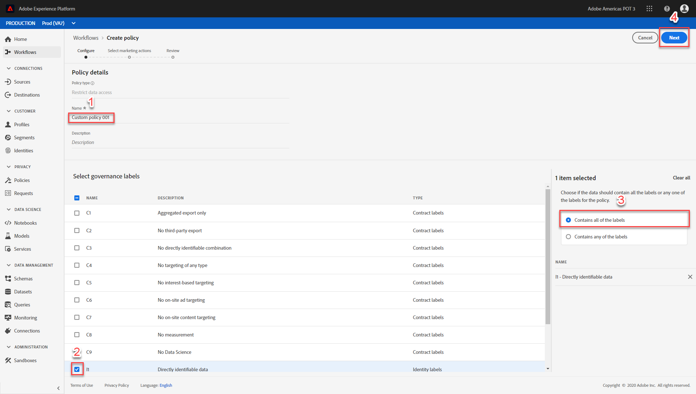
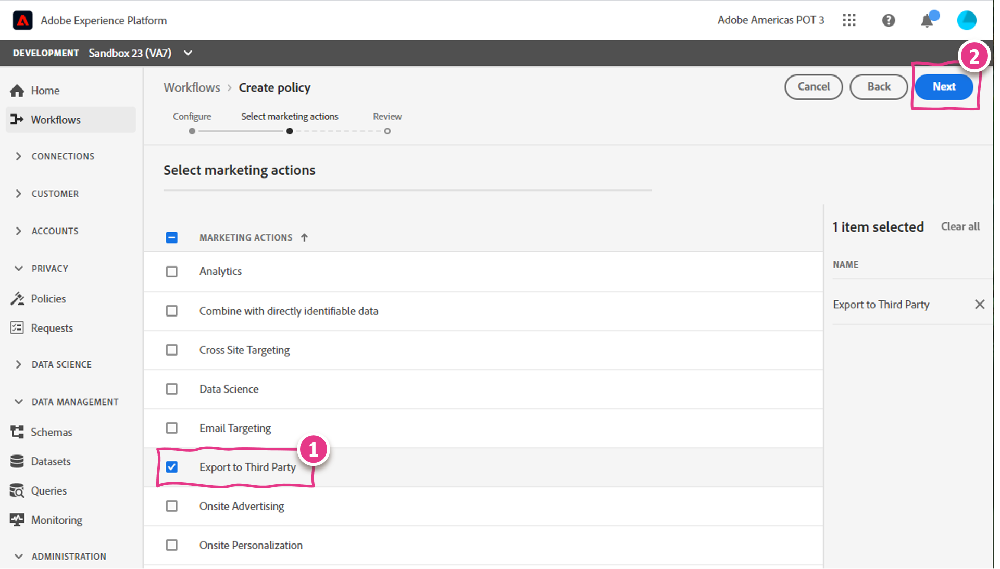
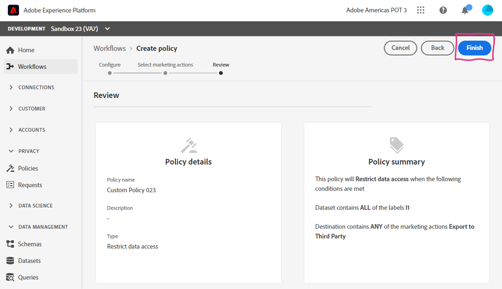

Lab - DULE - Apply Data Usage Label and Create Custom Data Usage Policy
==========
<table style="border-collapse: collapse; border: none;" class="tab" cellspacing="0" cellpadding="0">

<tr style="border: none;">

<td width="600" style="border: none;">
<table>
<tbody valign="top">
      <tr width="500">
            <td valign="top"><h3>Objective:</h3>
            </td>
            <td valign="top"> This lab will show you how to apply a data usage labels to a dataset field and create a custom data usage policy.
            </td>
     </tr>
     <tr width="500">
           <td valign="top"><h3>Prerequisites:</h3></td>
           <td valign="top"> <li>dataset in place</li>
           </td>
     </tr>
</tbody>
</table>
</td>

<td style="border: none;" valign="top">

<table>
<tbody valign="top">
      <tr>
            <td valign="middle" height="70"><b>section</b></td>
            <td valign="middle" height="70">
            </td>
      </tr>
      <tr>
            <td valign="middle" height="70"><b>version</b></td>
            <td valign="middle" height="70">1.0.1</td>
      </tr>
      <tr>
            <td valign="middle" height="70"><b>date</b></td>
            <td valign="middle" height="70">2020-04-10</td>
      </tr>
</tbody>
</table>
</td>

</tr>
</table>

Before we begin go to [https://platform.adobe.com/home](https://platform.adobe.com/home). Follow the instructions detailed below.

Instructions:
-----------------
1. In the left-hand menu, navigate to "Datasets". Verify you're on the "Browse" tab. Scroll down and select the "CRM Profile Dataset" dataset.

      

2. Click "Data governance" tab. Select "address" in the FIELD NAME list. Click "Edit governance labels".

      

3. In the Edit governance labels overlay, expand "IDENTITY LABELS". Select "I1" and click the "Save changes" button.

      
      
Congratulations, you applied your first data usage label to a dataset field. Simple, right?
      
4. In the left-hand menu, navigate to Policies. Verify you're on the "Browse" tab. Click "+ Create policy" in top right corner.

      
      
5. Under the Policy details, enter name "Custom Policy". Under Select governance labels, select "I1". On the right-hand side, make sure "Contains all of the labels" radio button is selected. Click "Next" button in the top right corner.
      
      

6. Select "Export to Third Party". Click "Next" button in the top right corner.

      

7. Review the policy and click "Finish"

      

      
Congratulations, you created a custom data usage policy.
 
 
 

Return to [Lab Agenda Directory](https://github.com/adobe/AEP-Hands-on-Labs/blob/master/labs/travel/README.md#lab-agenda)
