# Lab - Build a Bookings schema (ExperienceEvent)

<table style="border-collapse: collapse; border: none;" class="tab" cellspacing="0" cellpadding="0">

<tr style="border: none;">

<td width="600" style="border: none;">
<table>
<tbody valign="top">
      <tr width="500">
            <td valign="top"><h3>Objective:</h3></td>
            <td valign="top"> This lab will show you how to construct a schema
            </td>
     </tr>
     <tr width="500">
           <td valign="top"><h3>Prerequisites:</h3></td>
           <td valign="top"> none
           </td>
     </tr>
</tbody>
</table>
</td>

<td style="border: none;" valign="top">

<table>
<tbody valign="top">
      <tr>
            <td valign="middle" height="70"><b>section</b></td>
            <td valign="middle" height="70"></td>
      </tr>
      <tr>
            <td valign="middle" height="70"><b>version</b></td>
            <td valign="middle" height="70">1.0.10</td>
      </tr>
      <tr>
            <td valign="middle" height="70"><b>date</b></td>
            <td valign="middle" height="70">2020-01-06</td>
      </tr>
</tbody>
</table>
</td>

</tr>
</table>

Before we begin go to [https://platform.adobe.com/home](https://platform.adobe.com/home). Follow the instructions detailed below.

## Instructions:

1. In the left-hand menu, navigate to "Schemas"

      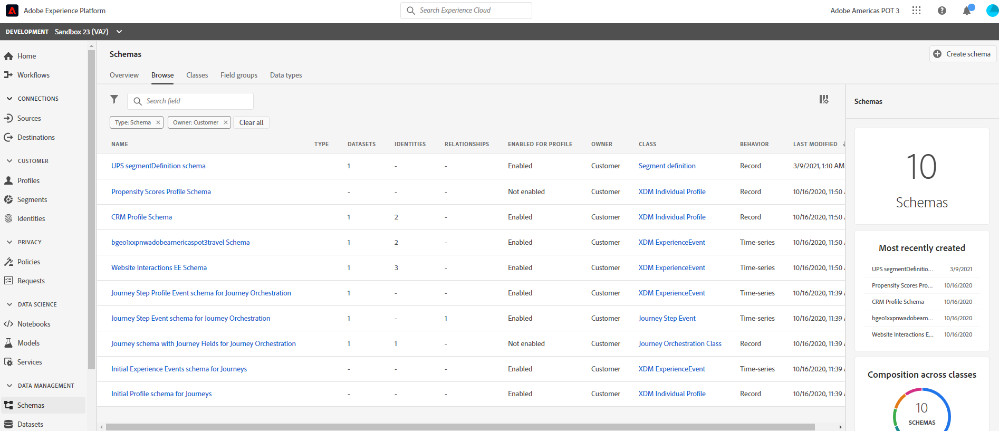

2. Click "Create Schema" on the top right

      

3. Click on "Untitled Schema" in the structure view

    <!---
    
    --->

    <kbd></kdb>

4. In the right-hand menu, name it "Bookings EE Schema &lt;your-assigned-number>" (Description is optional)
   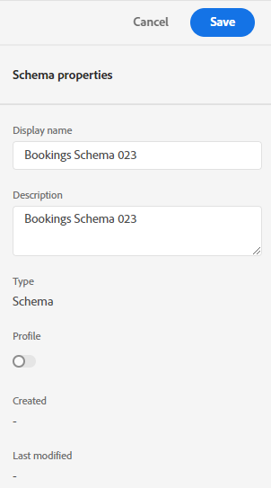
5. In the left-hand schema composition menu, click on the "Assign" button across from Class

    <!---
    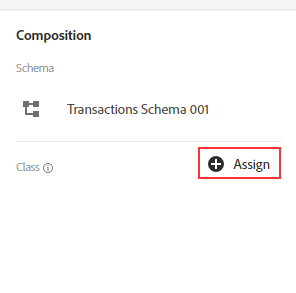
    --->

    <kbd></kdb>

    Here's where you can choose your base level schema behavior:
    - Time-based Events (XDM ExperienceEvent)
    - Customer Snapshots (XDM Individual Profile)

      

      Note: There are other classes available out of the box that represent specific objects needed for Experience Modeling.

6. In this example, choose "XDM ExperienceEvent" and click "Assign class"

      

7. Now, click on the "Add" button across from "Mixins" on the left panel

    <!---
    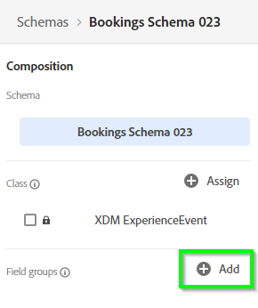
    --->

    <kbd></kdb>

      Here's where you can build your own Mixin or use a prior/similar Mixin object that conforms to your data.

8. There are many out of the box Mixins already available.

      

     Click on an Adobe pre-built Mixin and hit the "Preview mixin structure" option on the right-hand side to see it's contents of a Mixin

      

9. Hit Back to get back to the list of Mixins.

      

10. In this lab we will be adding two pre built mixins listed below

    - Booking Details Mixin, and
    - identities

    Search for 'Booking Details Mixin' Select the mixin and hit Assign Mixin

    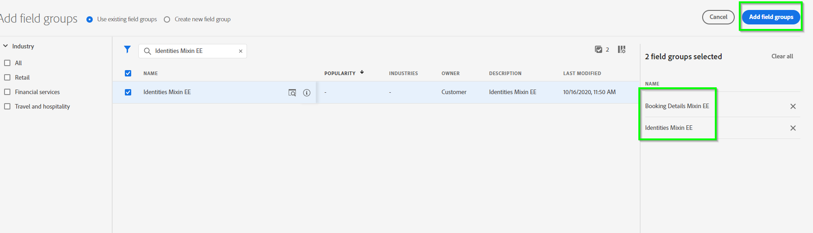

    Your schema will now have the Order details object and all of the fields within this object

      <!---
      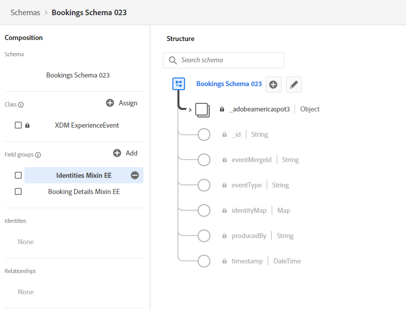
      --->

    <kbd></kdb>

    Hit +Add to go back to the Mixin list

       <!---
       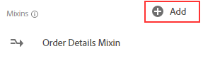
       --->

    <kbd></kdb>

    And, repeat the steps for 'identities' mixin

    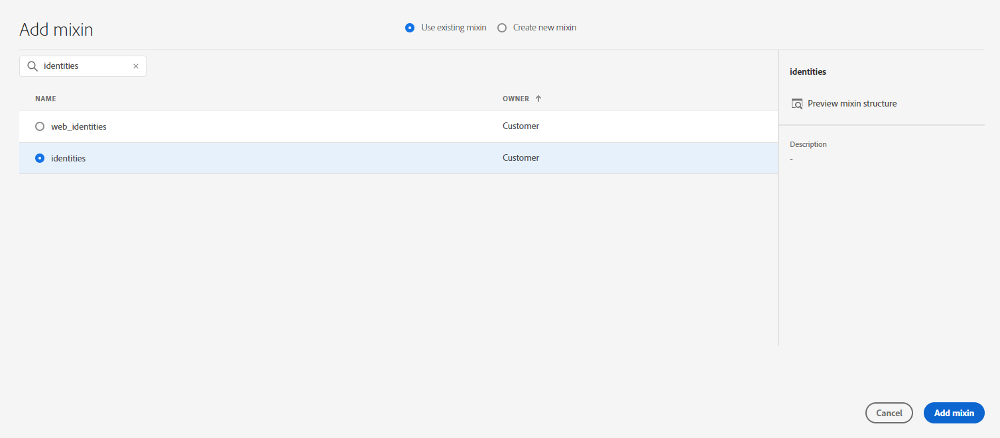

11) Now, we'll also create a new Mixin from scratch. Go back and hit the +Add button on the left panel.

       <!---
       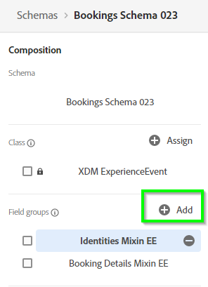
       --->

    <kbd></kdb>

12) Select "Create new mixin" on the very top

      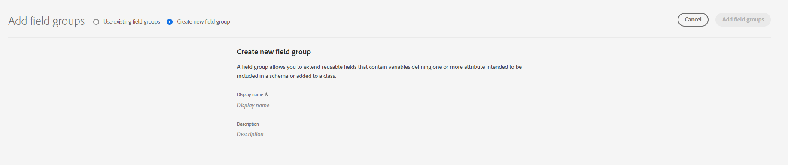

13. Display name is "Order Details Mixin &lt;your-assigned-number>" and then hit 'Add Mixin'
    
14. In the left-hand schema composition menu, click on your newly create Mixin (it should be highlighted now)

    <!---
    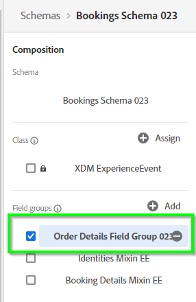
    --->

    <kbd></kdb>

15. Notice that on the Structure view a '+Add Field' appears next to the Schema name, Click it to start adding fields

    <!---
    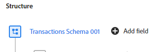
    --->

    <kbd></kdb>

16. On the Field Properties panel to the right add the following  
     FieldName = orderDetails
    Description = Order Details
    Type = Object

    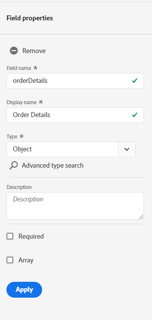

    Scroll  down and hit Apply

    

17. Next, we will be adding fields to the 'orderDetails' object Click "+Add Field" next to this object

    <!---
    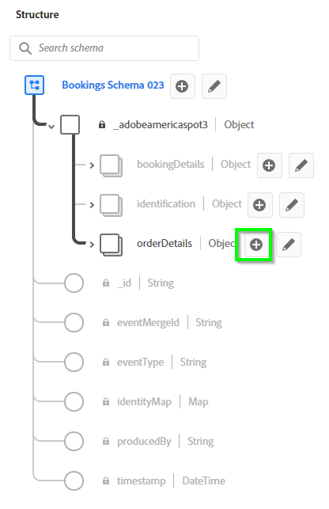
    --->

    <kbd></kdb>

18) On the Field Properties panel to the right add the following  
     FieldName = orderID
    Description = Order ID
    Type = String

     

     Scroll down and hit Apply

    

19. We will be adding one more field to the 'orderDetails' object Click "+Add Field" next to this object

    <!---
    
    --->

    <kbd></kdb>

20) On the Field Properties panel to the right add the following  
     FieldName = reservationid
    Description = Reservation ID
    Type = String

    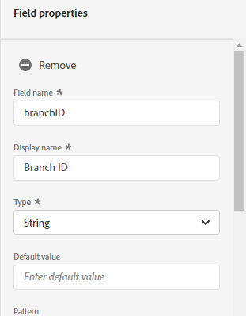

    Scroll down and hit Apply

    

21. We will be adding one more field to the 'orderDetails' object Click "+Add Field" next to this object

    <!---
    
    --->

    <kbd></kdb>

22) On the Field Properties panel to the right add the following  
     FieldName = orderType
    Description = Order Type
    Type = String

    

    Scroll down and hit Apply

    

23. We are done with modeling the schema. To Save your work hit Save on the top right corner. Make sure that your schema structure looks like the one in the screenshot below

     <!---
     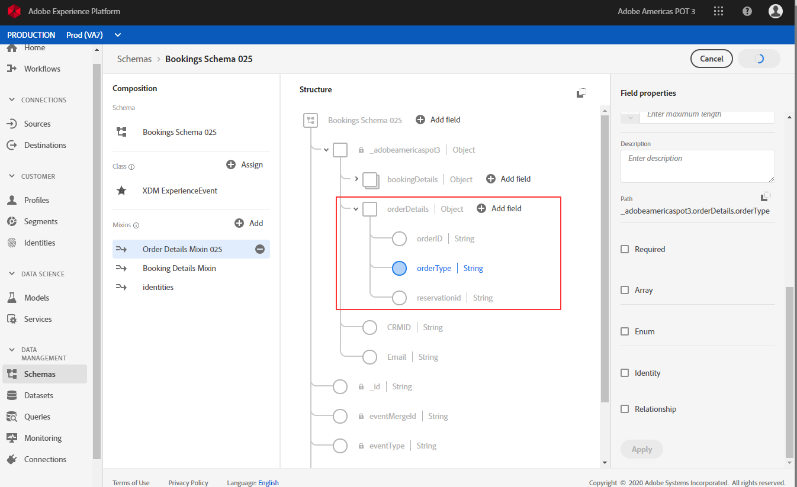
     --->
     <kbd></kdb>

24. Congratulations!!! you have constructed your schema.

 
 
 

Return to [Lab Agenda Directory](https://github.com/adobe/AEP-Hands-on-Labs/blob/master/labs/travel/README.md#lab-agenda)
