# Lab - Segmentation - Simple ExperienceEvent Segmentation
 
<table style="border-collapse: collapse; border: none;" class="tab" cellspacing="0" cellpadding="0">
 
<tr style="border: none;">
 

<td width="600" style="border: none;">
<table>
<tbody valign="top">
      <tr width="500">
            <td valign="top"><h3>Objective:</h3></td>
            <td valign="top"> In this exercise, we’ll create a basic segment using a single field in Call Center ExperienceEvent. 
       On an ongoing basis, a hotelier wants to create a basic segment for customers who make a booking with a Call Center representative. This segment will be added to other segments for other marketing events. 
            </td>
     </tr>
     <tr width="500">
           <td valign="top"><h3>Prerequisites:</h3></td>
           <td valign="top"> none</td>
     </tr>
</tbody>
</table>
</td>

 

<td style="border: none;" valign="top">
 
<table>
<tbody valign="top">
      <tr>
            <td valign="middle" height="70"><b>section</b></td>
            <td valign="middle" height="70"></td>
      </tr>
      <tr>
            <td valign="middle" height="70"><b>version</b></td>
            <td valign="middle" height="70">1.0.1</td>
      </tr>
      <tr>
            <td valign="middle" height="70"><b>date</b></td>
            <td valign="middle" height="70">2020-01-06</td>
      </tr>
</tbody>
</table>
</td>

 
</tr>
</table>
 
## Instructions:
 
1. Navigate to Segment Builder in the left navigation and select Create segment.
 
   
 
2. Click the gear icon to the right of Fields in the left pane.
 
3. Verify ‘Show full XDM schema’ is selected, and if not, select it
 
  
 
4. Click on the gear icon again to hide the setting.
 
5. Select ‘Events’ under Fields.
 
6. Click on ‘XDM ExperienceEvent’ under Browse Classes.
 
7. Click on ‘Adobeamericaspot 3’ to expand the objects below that namespace.

  

8. Click on ‘callCenterDetails’

  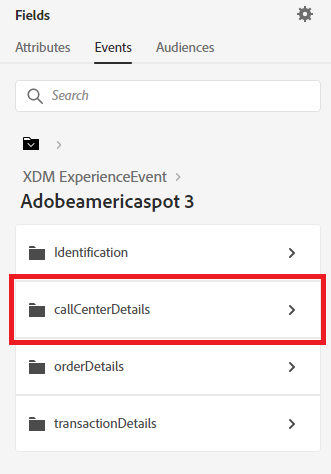

 
9. Drag the ‘callSelectedReason’ field over to the Segment canvas
 
  
 
10. In the text box to the right of equals, type “Reservation Place Booking” and press ‘Enter’
 
  
 
11. Enter the segment name “Call Center Reservation Booking”.
 
12. Enter the same value as the description.
 
13. Save the Segment
 
  
 
NOTE: Estimate link may not show results if qualified profiles are statistically small and not recognized across datset scans
 
 
 
 
 
# Lab - Segmentation - Sequential Segmentation
 
<table style="border-collapse: collapse; border: none;" class="tab" cellspacing="0" cellpadding="0">
 
<tr style="border: none;">
 

<td width="600" style="border: none;">
<table>
<tbody valign="top">
      <tr width="500">
            <td valign="top"><h3>Objective:</h3></td>
            <td valign="top"> In this exercise, we’ll create a segment using both a Profile Attribute and ExperienceEvents using a Sequential Segment that compares multiple event conditions 
       A hotelier wants to email a spa package offer to existing female customers who have viewed or begun an online booking for their Lily Suites property but have not booked the property after either online event in the last 24 hours. </td>
     </tr>
     <tr width="500">
           <td valign="top"><h3>Prerequisites:</h3></td>
           <td valign="top"> none</td>
     </tr>
</tbody>
</table>
</td>

 

<td style="border: none;" valign="top">
 
<table>
<tbody valign="top">
      <tr>
            <td valign="middle" height="70"><b>section</b></td>
            <td valign="middle" height="70"></td>
      </tr>
      <tr>
            <td valign="middle" height="70"><b>version</b></td>
            <td valign="middle" height="70">1.0.1</td>
      </tr>
      <tr>
            <td valign="middle" height="70"><b>date</b></td>
            <td valign="middle" height="70">2020-01-06</td>
      </tr>
</tbody>
</table>
</td>

 
</tr>
</table>
 
## Instructions:
 
1. Navigate to Segment Builder in the left navigation and select Create segment.
 

 
2. Click the gear icon to the right of Fields in the left pane
 
3. Verify ‘Show full XDM schema’ is selected
 

 
4. Click on the gear icon again to hide the setting
 
5. Select ‘Attributes’ under Fields

 
6. Click on the ‘XDM Individual Profile’ object under Browse Attributes
 

 
7. Click on ‘Person’

 
8. Drag the ‘Gender’ field to the Segment canvas
 
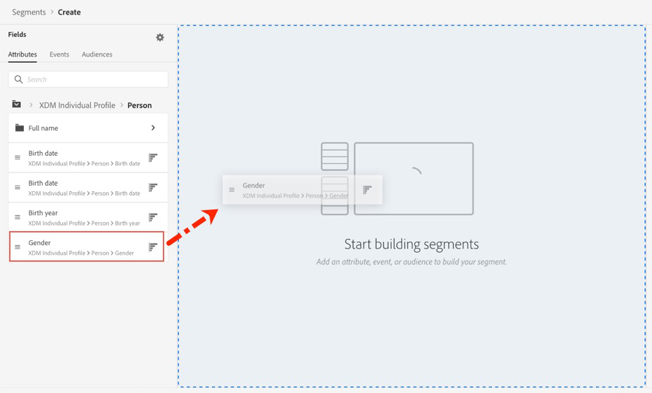
 
9. Start entering ‘Female’ in the text box and when the value displays, select it and press Enter. The ‘Gender’ field is an enum field to limit the values stored in that field.
 

 
10. Next, select ‘Events’ under Fields in the left pane

 
11. Under ‘Event Types’ locate the ‘Product Views’ event and drag that to the segment canvas below the Profile attribute just added
 
12. Under ‘Events’ in the left pane, locate ‘Checkouts’ and drag that to the segment canvas below the ‘Product Views’ event so that they are vertically stacked.
 
13. Update the operator to ‘Or’ between ‘Product Views’ and ‘Checkouts’
 
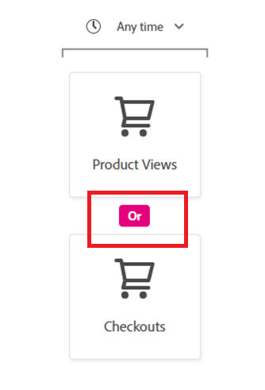
 
14. Under ‘Events in the left pane, locate ‘Purchases’ and drag that to the segment canvas to the right of the ‘Product Views’ and ‘Purchase’ events
 
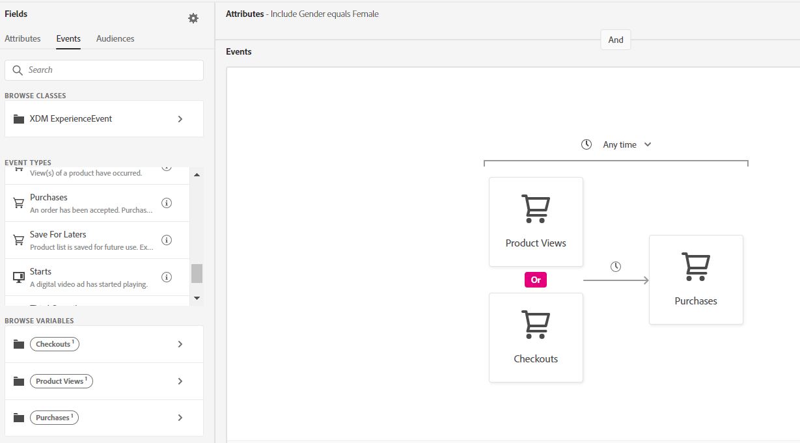
 
15. Click on ‘Product Views’ in the segment canvas. A container will appear below to Include and XDM ExperienceEvent
 
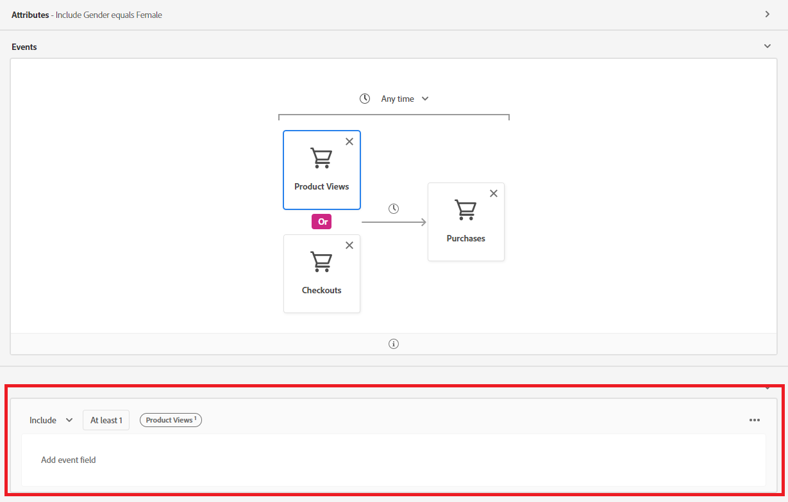
 
16. In the left pane, click on ‘XDM ExperienceEvent’ and ‘Product list items’ in the resulting display
 
17. Select the ‘SKU’ field and drag that into the ‘XDM ExperienceEvent’ container for ‘Product Views’
 
 
18. Enter ‘prd1030’ in the text box to the right of SKU = and press ‘Enter’
 
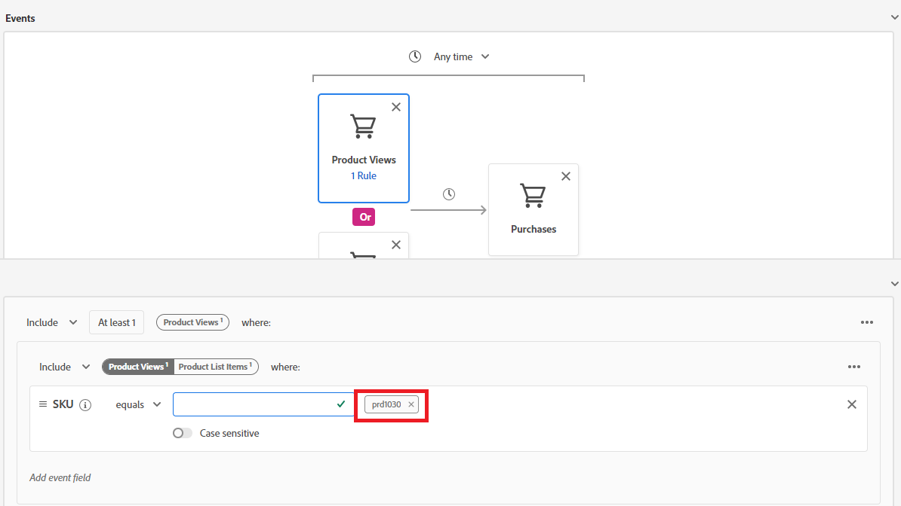
 
19. Click on ‘Checkouts’ in the segment canvas. A container will appear below to Include and XDM ExperienceEvent
 
20. In the left pane, click on ‘XDM ExperienceEvent’ and ‘Product list items’ in the resulting display
 
21. Select the ‘SKU’ field and drag that into the ‘XDM ExperienceEvent’ container for ‘Checkouts’
 
 

 
 
 
22. Enter ‘prd1030’ in the text box to the right of SKU = and press ‘Enter’
 
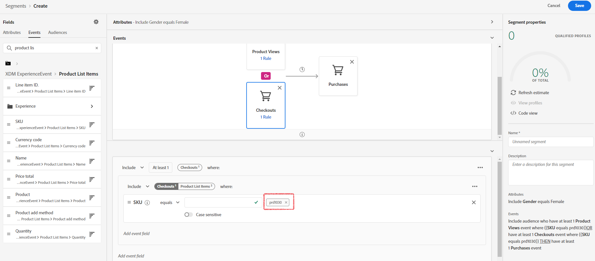
 
23. Click on ‘Purchases’ in the segment canvas. A container will appear below to Include and XDM ExperienceEvent
 
 

 
24. In the left pane, click on ‘XDM ExperienceEvent’ and ‘Product list items’ in the resulting display
 
25. Select the ‘SKU’ field and drag that into the ‘XDM ExperienceEvent’ container for ‘Purchases’
 
26. Enter ‘prd1030’ in the text box to the right of SKU = and press ‘Enter’
 

 
27. Change the container operator to ‘Exclude’ for ‘Purchases’
 
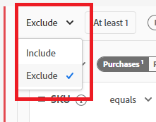
 
28. At the top of the ‘Events’ canvas, update the time value to ‘In last 24 Hour(s)’
 
29. Enter the segment name “Lily Suites High Intent Female Bookers”.
 
30. Enter the same value as the description
 
31. Save the Segment
 
    
 
 
 
 
 
# Lab - Segmentation - Dynamic Segmentation
 
<table style="border-collapse: collapse; border: none;" class="tab" cellspacing="0" cellpadding="0">
 
<tr style="border: none;">
 

<td width="600" style="border: none;">
<table>
<tbody valign="top">
      <tr width="500">
            <td valign="top"><h3>Objective:</h3></td>
            <td valign="top"> In this exercise, we’ll create a segment using Commerce ExperienceEvents and dynamic segmentation. Dynamic segmentation solves the scalability problems marketers traditionally face when building segments for marketing campaigns or other use cases where setting up multiple variations of the same segment was required. 
       On an ongoing basis, a hotelier wants to remarket to customers who have clicked through an email offer to any property, started the booking online within 3 days, but have not booked the hotel room within 1 day. </td>
     </tr>
     <tr width="500">
           <td valign="top"><h3>Prerequisites:</h3></td>
           <td valign="top"> none</td>
     </tr>
</tbody>
</table>
</td>

 

<td style="border: none;" valign="top">
 
<table>
<tbody valign="top">
      <tr>
            <td valign="middle" height="70"><b>section</b></td>
            <td valign="middle" height="70"></td>
      </tr>
      <tr>
            <td valign="middle" height="70"><b>version</b></td>
            <td valign="middle" height="70">1.0.1</td>
      </tr>
      <tr>
            <td valign="middle" height="70"><b>date</b></td>
            <td valign="middle" height="70">2020-01-06</td>
      </tr>
</tbody>
</table>
</td>

 
</tr>
</table>
 
## Instructions:
 
1. Navigate to Segment Builder in the left navigation and select Create segment.
 
   
 
2. Click the gear icon to the right of Fields in the left pane
 
3. Verify ‘Show full XDM schema’ is selected
 
   
 
4. Click on the gear icon again to hide the setting
 
5. In the left pane, select ‘Events’ under Fields
 
6. In the search box, enter ‘eVar1’
 
   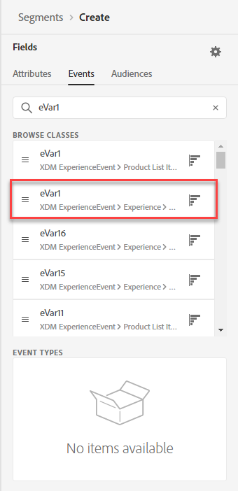
 
7. Drag ‘eVar1’ to the segment canvas and Include eVar1 equlas 'Email'. Note: eVar1 in our implementation contains the Marketing Channel.
 
   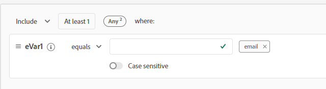
 
8. In the left pane, clear out the Search box
 
9. Under ‘Event Types’, locate ‘Checkouts’, and drag this to the segment canvas to the right of the ‘Any’ event
 
   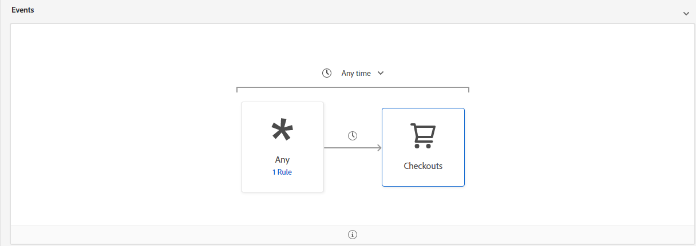
 
10. In the left pane, locate ‘Purchases’ and drag this to the segment canvas to the right of the ‘Checkouts’ event.
 
   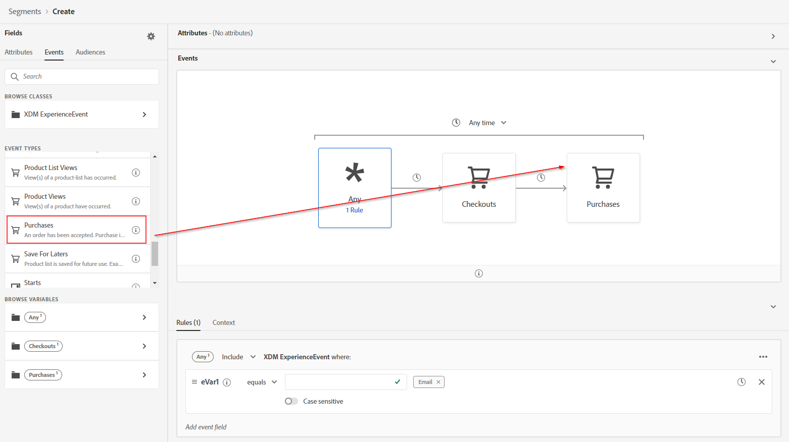
 
11. Click on ‘Any’ in the segment canvas
 
12. Type ‘Email’ in the text box to the right of ‘eVar1’ equals and press Enter
 
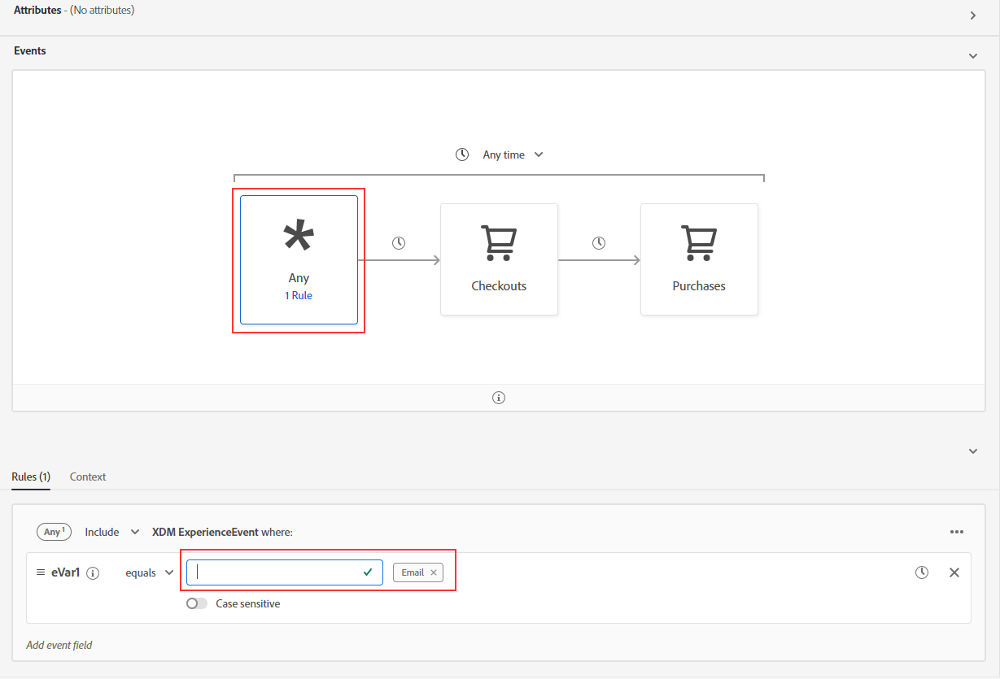
 
13. Click on ‘Checkouts' in the segment canvas
 
14. In the left pane, search for 'SKU'
 
15. Select the ‘SKU’ field and drag that into the ‘XDM ExperienceEvent’ container for ‘Checkouts’
 
    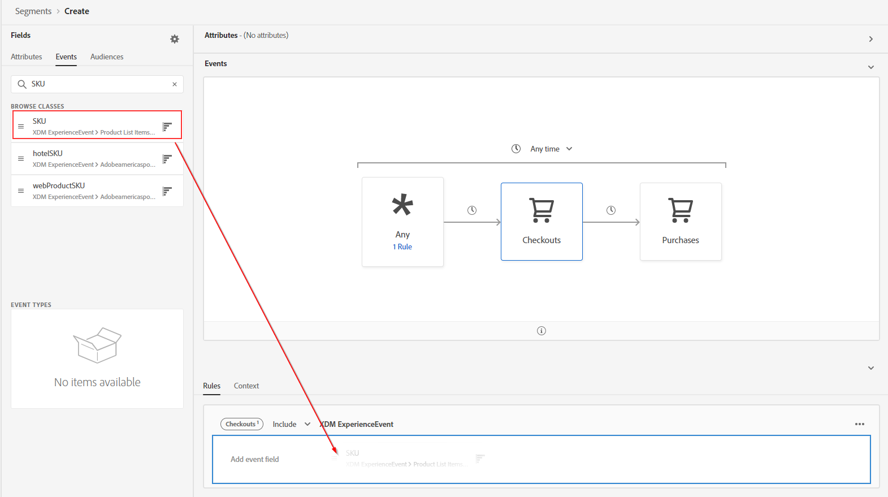
 
16. Change the operator to “exists”
 
    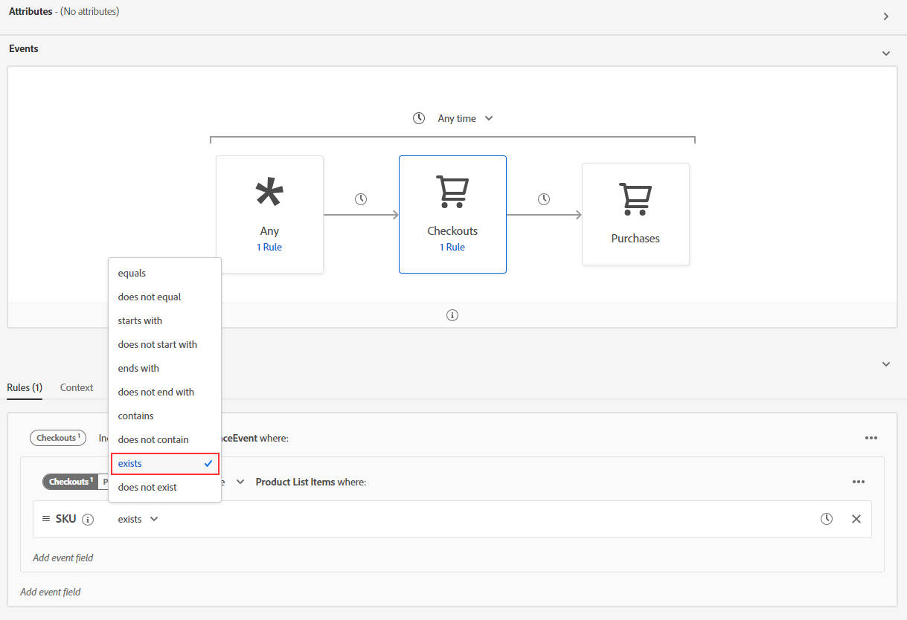
 
17. Clear the search box. And Select 'Puchases' event.
 
18. Search for ‘SKU’ and drag that into the ‘XDM ExperienceEvent’ container for ‘Purchases’
 
    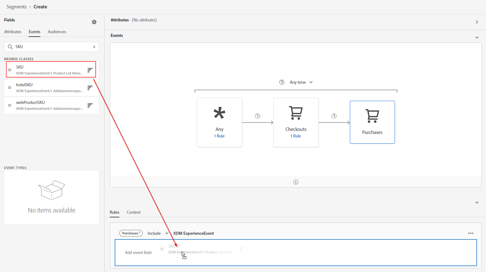
 
19. Clear the search box
 
    
 
20. Now, we are going to make this a dynamic segment. We will be using the SKU from previous events to make sure that that same SKU is being checked for the subsequent events in the segment. To make is easy for the users segment builder visualizes these parameters wunder 'Browse Variables' in the left panel.
 
    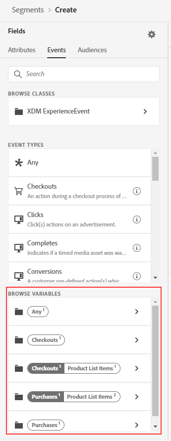
 
21. Select the 'Checkout Product List Items Varaibles amd drag and drop the SKU to the condition section that says 'Add to compare operants.
 
    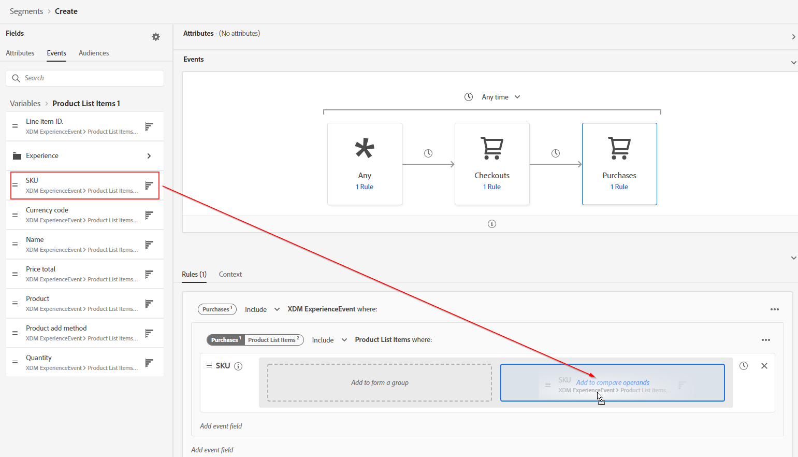
 
22. The dynamic condition should now look like this
 
    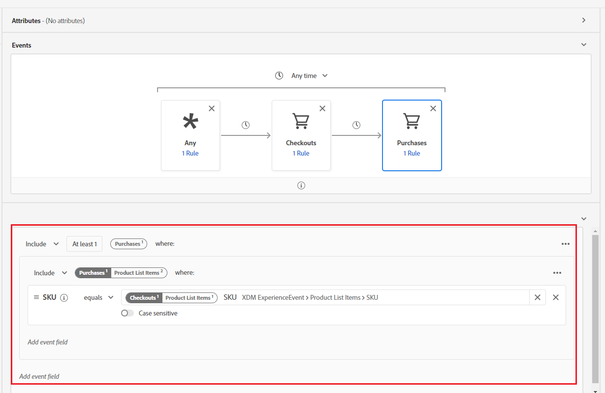
 
23. Change the ‘XDM ExperienceEvent’ container for ‘Purchases1’ to ‘Exclude’
 
    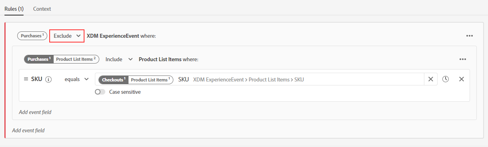
 
24. At the top of the ‘Events’ canvas, update the time value to ‘In last 24 Hour(s)’
 
25. Enter the segment name “Email Channel Online Reservation Abandoners”.
 
26. Enter the same value as the description
 
29. Save the Segment
 
    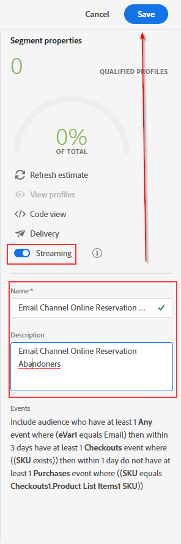
 
Return to [Lab Agenda Directory](https://github.com/adobe/AEP-Hands-on-Labs/blob/master/labs/travel/README.md#lab-agenda)

